# Data Dictionary

Summary of all data elements provided by endpoints and what they are converted to (where there are conversions) by the libraries fetching the data.

I also attempt to show data lineage and any transformations along the way. Where I'm making the changes this is definitive. Where it's Zwiftpower or Zwiftracing it's my understanding and could be wrong. For everything listed as Zwiftpower consider that Zwift as master is implied. I have no way to identify what transformation might occur between Zwift internal systems and that which is exposed in Zwiftpower so effectively "mastered by Zwift" in Zwiftpower can be consdiered equivalent to "Mastered by Zwiftpower".

## Zwift Power Data

### Cyclist

**Purpose:** Wrapper for cyclist profile and race history with key metrics extracted from most recent race.

**Overview:** The Cyclist endpoint returns a cyclist profile with a `data` array containing race history. Key information is extracted from the last (most recent) race entry and exposed as direct attributes. The full race history is accessible via the `racelog` property.

---

#### Zwift ID

| Raw API Field | Python Attribute | Type | Transformation | Lineage           |
| ------------- | ---------------- | ---- | -------------- | ----------------- |
| `zwid`        | `zwift_id`       | int  | Field renamed  | Mastered in Zwift |

The Zwift ID of the rider, extracted from the last race entry.

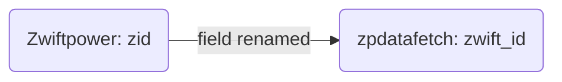

---

#### Name

| Raw API Field | Python Attribute | Type | Transformation | Lineage           |
| ------------- | ---------------- | ---- | -------------- | ----------------- |
| `name`        | `name`           | str  | None           | Mastered in Zwift |

The rider's display name, extracted from the last race entry.

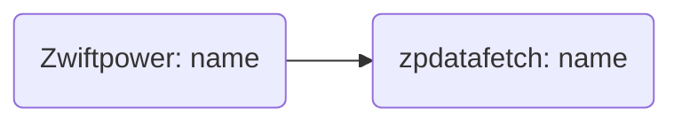

---

#### Team ID

| Raw API Field | Python Attribute | Type        | Transformation                                        | Lineage           |
| ------------- | ---------------- | ----------- | ----------------------------------------------------- | ----------------- |
| `tid`         | `team_id`        | int \| None | Field renamed, converted to int or None if 0 or empty | Mastered in Zwift |

The team ID of the rider's current team, extracted from the last race entry. Set to None if rider has no team.

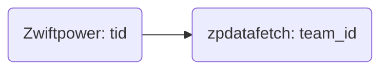

---

#### Team Name

| Raw API Field | Python Attribute | Type        | Transformation | Lineage           |
| ------------- | ---------------- | ----------- | -------------- | ----------------- |
| `tname`       | `team_name`      | str \| None | Field renamed  | Mastered in Zwift |

The team name of the rider's current team, extracted from the last race entry.

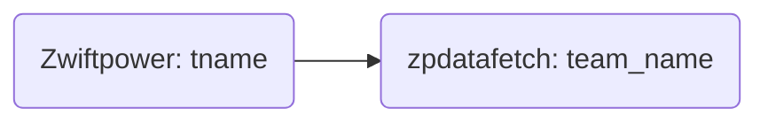

---

#### Gender

| Raw API Field | Python Attribute | Type | Transformation                                             | Lineage           |
| ------------- | ---------------- | ---- | ---------------------------------------------------------- | ----------------- |
| `male`        | `gender`         | str  | Convert from numeric to string. Array extraction if needed | Mastered in Zwift |

The rider's gender. Raw API provides as integer, transformed to readable string.

**Conversion mapping:**

- `0` → `"female"`
- `1` → `"male"`

If field is in array format `[value, flag]`, the first element is extracted before conversion.

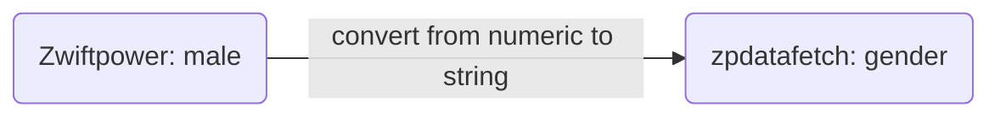

---

#### Category (Mixed)

| Raw API Field | Python Attribute | Type | Transformation                                                           | Lineage           |
| ------------- | ---------------- | ---- | ------------------------------------------------------------------------ | ----------------- |
| `div`         | `category`       | str  | Convert from numeric code to category letter. Array extraction if needed | Mastered in Zwift |

The rider's men's racing category based on FTP/weight ratio.

**Conversion mapping:**

- `0` → `""` (no category)
- `5` → `"A+"` (top category)
- `10` → `"A"`
- `20` → `"B"`
- `30` → `"C"`
- `40` → `"D"`

If field is in array format `[value, flag]`, the first element is extracted before conversion.

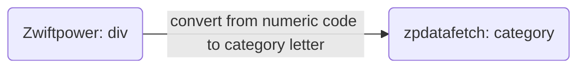

---

#### Category (Women's)

| Raw API Field | Python Attribute | Type | Transformation                                                           | Lineage           |
| ------------- | ---------------- | ---- | ------------------------------------------------------------------------ | ----------------- |
| `divw`        | `category_women` | str  | Convert from numeric code to category letter. Array extraction if needed | Mastered in Zwift |

The rider's women's racing category. Uses same numeric encoding as men's category.

**Conversion mapping:**

- `0` → `""` (no category)
- `5` → `"A+"` (top category)
- `10` → `"A"`
- `20` → `"B"`
- `30` → `"C"`
- `40` → `"D"`

If field is in array format `[value, flag]`, the first element is extracted before conversion.

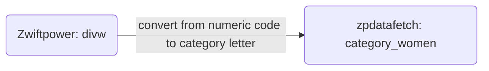

---

#### FTP

| Raw API Field | Python Attribute | Type | Transformation                                            | Lineage  |
| ------------- | ---------------- | ---- | --------------------------------------------------------- | -------- |
| `ftp`         | `zftp`           | int  | Field renamed, array extraction if `[value, flag]` format | Mastered |

Functional Threshold Power in watts. This is Zwift's internal FTP value, which may differ from the rider's actual FTP.

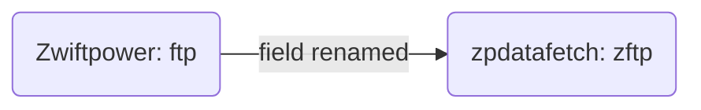

---

#### Height

| Raw API Field | Python Attribute | Type | Transformation                             | Lineage  |
| ------------- | ---------------- | ---- | ------------------------------------------ | -------- |
| `height`      | `height`         | int  | Array extraction if `[value, flag]` format | Mastered |

Rider height in centimeters.

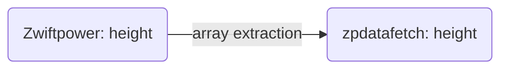

---

#### Weight

| Raw API Field | Python Attribute | Type  | Transformation                             | Lineage  |
| ------------- | ---------------- | ----- | ------------------------------------------ | -------- |
| `weight`      | `weight`         | float | Array extraction if `[value, flag]` format | Mastered |

Rider weight in kilograms.

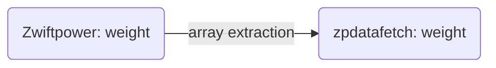

---

#### Skill

| Raw API Field | Python Attribute | Type  | Transformation                             | Lineage  |
| ------------- | ---------------- | ----- | ------------------------------------------ | -------- |
| `skill`       | `skill`          | float | Array extraction if `[value, flag]` format | Mastered |

ZwiftPower skill rating, a numerical score representing rider performance history.


---

#### Age

| Raw API Field | Python Attribute | Type | Transformation | Lineage  |
| ------------- | ---------------- | ---- | -------------- | -------- |
| `age`         | `age`            | str  | None           | Mastered |

Rider age as a string.

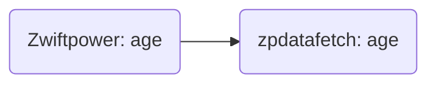

---

#### Race History

| Raw API Field  | Python Attribute     | Type      | Transformation                                  | Lineage  |
| -------------- | -------------------- | --------- | ----------------------------------------------- | -------- |
| `data` (array) | `racelog` (property) | ZPRacelog | Lazy-loaded, converts array to ZPRacelog object | Mastered |

Array of race history entries. Each entry contains full race result data (see Result section). Accessible via the `racelog` property which returns a ZPRacelog object containing ZPRaceFinish objects.

**Note:** The `data` array is ordered with most recent race last (index -1).

---

**Fields Not Extracted:** All other fields from the raw API are stored in `_data` for backwards compatibility but not exposed as typed attributes. Access the full raw data via `.asdict()` or `._data`.

---

### League

**Purpose:** League standings with teams and results.

---

#### League ID

| Raw API Field | Python Attribute | Type | Transformation         | Lineage  |
| ------------- | ---------------- | ---- | ---------------------- | -------- |
| N/A           | `league_id`      | int  | Injected, not from API | Mastered |

The league ID. This is injected by the library, not provided in the API response.

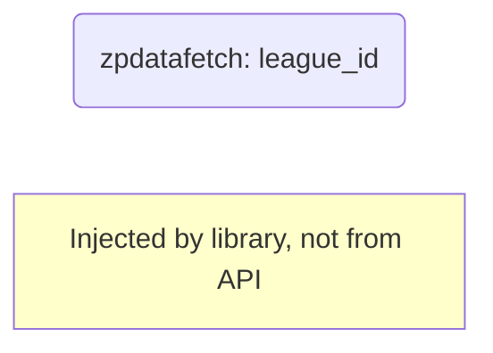

---

#### Teams

| Raw API Field | Python Attribute | Type | Transformation                            | Lineage  |
| ------------- | ---------------- | ---- | ----------------------------------------- | -------- |
| `teams`       | `_teams`         | dict | Converted to dict of ZPLeagueTeam objects | Mastered |

Dictionary mapping team_id to ZPLeagueTeam objects containing team information.

**ZPLeagueTeam structure:**

#### Team ID

| Raw API Field | Python Attribute | Type | Transformation | Lineage  |
| ------------- | ---------------- | ---- | -------------- | -------- |
| (dict key)    | `team_id`        | int  | From dict key  | Mastered |

The unique team identifier.

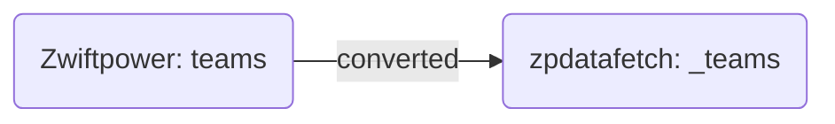

---

#### Team Name

| Raw API Field | Python Attribute | Type | Transformation | Lineage  |
| ------------- | ---------------- | ---- | -------------- | -------- |
| `tname`       | `name`           | str  | Field renamed  | Mastered |

The team's display name.

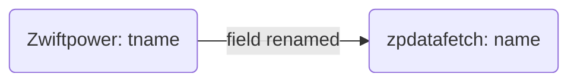

---

#### Background Color

| Raw API Field | Python Attribute   | Type | Transformation | Lineage  |
| ------------- | ------------------ | ---- | -------------- | -------- |
| `tbc`         | `color_background` | str  | Field renamed  | Mastered |

The team's background color code.

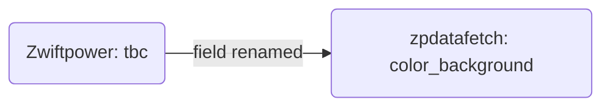

---

#### Border Color

| Raw API Field | Python Attribute | Type | Transformation | Lineage  |
| ------------- | ---------------- | ---- | -------------- | -------- |
| `tbd`         | `color_border`   | str  | Field renamed  | Mastered |

The team's border color code.

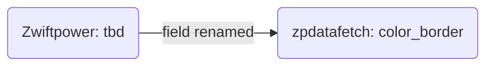

---

#### Text Color

| Raw API Field | Python Attribute | Type | Transformation | Lineage  |
| ------------- | ---------------- | ---- | -------------- | -------- |
| `tc`          | `color_text`     | str  | Field renamed  | Mastered |

The team's text color code.

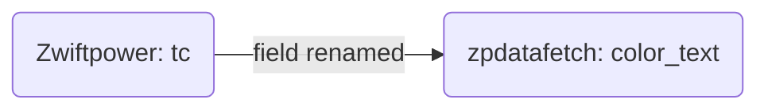

---

#### Standings

| Raw API Field | Python Attribute | Type | Transformation                              | Lineage  |
| ------------- | ---------------- | ---- | ------------------------------------------- | -------- |
| `data`        | `_standings`     | list | Converted to list of ZPLeagueResult objects | Mastered |

List of rider standings in the league.

**ZPLeagueResult structure:**

#### Position

| Raw API Field | Python Attribute | Type | Transformation | Lineage  |
| ------------- | ---------------- | ---- | -------------- | -------- |
| `pos`         | `position`       | int  | Field renamed  | Mastered |

The rider's current position in the league standings.

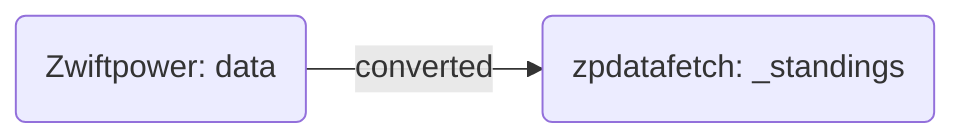

---

#### Zwift ID

| Raw API Field | Python Attribute | Type | Transformation | Lineage  |
| ------------- | ---------------- | ---- | -------------- | -------- |
| `zwid`        | `zwift_id`       | int  | Field renamed  | Mastered |

The rider's Zwift ID.

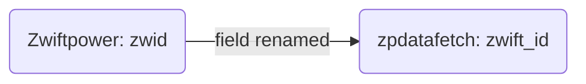

---

#### Account ID

| Raw API Field | Python Attribute | Type | Transformation | Lineage  |
| ------------- | ---------------- | ---- | -------------- | -------- |
| `aid`         | `aid`            | int  | None           | Mastered |

Account ID (purpose unknown).

```mermaid
flowchart LR
  A(Zwiftpower: aid) --> B(zpdatafetch: aid)
```

---

#### Name

| Raw API Field | Python Attribute | Type | Transformation | Lineage  |
| ------------- | ---------------- | ---- | -------------- | -------- |
| `name`        | `name`           | str  | None           | Mastered |

The rider's display name.

```mermaid
flowchart LR
  A(Zwiftpower: name) --> B(zpdatafetch: name)
```

---

#### Points

| Raw API Field | Python Attribute | Type  | Transformation | Lineage  |
| ------------- | ---------------- | ----- | -------------- | -------- |
| `points`      | `points`         | float | None           | Mastered |

The rider's total league points.

```mermaid
flowchart LR
  A(Zwiftpower: points) --> B(zpdatafetch: points)
```

---

#### Events

| Raw API Field | Python Attribute | Type | Transformation | Lineage  |
| ------------- | ---------------- | ---- | -------------- | -------- |
| `events`      | `events`         | int  | None           | Mastered |

Number of events the rider has participated in.

```mermaid
flowchart LR
  A(Zwiftpower: events) --> B(zpdatafetch: events)
```

---

#### Category

| Raw API Field | Python Attribute | Type | Transformation | Lineage  |
| ------------- | ---------------- | ---- | -------------- | -------- |
| `category`    | `category`       | str  | None           | Mastered |

The rider's racing category.

```mermaid
flowchart LR
  A(Zwiftpower: category) --> B(zpdatafetch: category)
```

---

#### Team ID

| Raw API Field | Python Attribute | Type | Transformation | Lineage  |
| ------------- | ---------------- | ---- | -------------- | -------- |
| `tid`         | `team_id`        | int  | Field renamed  | Mastered |

The rider's team ID.

```mermaid
flowchart LR
  A(Zwiftpower: tid) -- field renamed --> B(zpdatafetch: team_id)
```

---

#### Team Name

| Raw API Field | Python Attribute | Type | Transformation                            | Lineage  |
| ------------- | ---------------- | ---- | ----------------------------------------- | -------- |
| `tid`         | `team_name`      | str  | Resolved from team_id in teams dictionary | Mastered |

The rider's team name, resolved by looking up the team_id in the teams dictionary.

```mermaid
flowchart LR
  A(Zwiftpower: tid) -- resolved --> B(zpdatafetch: team_name)
```

---

#### Age

| Raw API Field | Python Attribute | Type | Transformation | Lineage  |
| ------------- | ---------------- | ---- | -------------- | -------- |
| `age`         | `age`            | int  | None           | Mastered |

The rider's age.

```mermaid
flowchart LR
  A(Zwiftpower: age) --> B(zpdatafetch: age)
```

---

#### Country Flag

| Raw API Field | Python Attribute | Type | Transformation | Lineage  |
| ------------- | ---------------- | ---- | -------------- | -------- |
| `flag`        | `flag`           | str  | None           | Mastered |

The rider's country flag code.

```mermaid
flowchart LR
  A(Zwiftpower: flag) --> B(zpdatafetch: flag)
```

---

#### Points History

| Raw API Field | Python Attribute | Type | Transformation | Lineage  |
| ------------- | ---------------- | ---- | -------------- | -------- |
| `history`     | `history`        | list | None           | Mastered |

Array of historical points values.

```mermaid
flowchart LR
  A(Zwiftpower: history) --> B(zpdatafetch: history)
```

---

**Excluded Fields:**

- Race level: `status`, `message`, `league_name`
- Rider level: `rank`, `skill`, `div`, `divw`

---

### Primes

**Purpose:** Race prime/sprint segment data organized by category and timing type.

---

#### Race ID

| Raw API Field | Python Attribute | Type | Transformation                    | Lineage  |
| ------------- | ---------------- | ---- | --------------------------------- | -------- |
| `race_id`     | `race_id`        | int  | Injected, not from data structure | Mastered |

The race ID. Injected by the library from the request context.

```mermaid
flowchart LR
  A(zpdatafetch: race_id)

  note[Injected by library, not from API]
  style note fill:#ffffcc
```

---

#### Categories

| Raw API Field   | Python Attribute | Type | Transformation                                            | Lineage  |
| --------------- | ---------------- | ---- | --------------------------------------------------------- | -------- |
| (category keys) | `_categories`    | dict | Nested dict: category → prime_type → list[ZPPrimeSegment] | Mastered |

Nested dictionary organizing prime data by category (A, B, C, D, etc.) and prime type (msec, elapsed).

**ZPPrimeSegment structure:**

#### Lap Number

| Raw API Field | Python Attribute | Type | Transformation | Lineage  |
| ------------- | ---------------- | ---- | -------------- | -------- |
| `lap`         | `lap`            | int  | None           | Mastered |

The lap number on which this sprint occurred.

```mermaid
flowchart LR
  A(Zwiftpower: lap) --> B(zpdatafetch: lap)
```

---

#### Segment Name

| Raw API Field | Python Attribute | Type | Transformation | Lineage  |
| ------------- | ---------------- | ---- | -------------- | -------- |
| `name`        | `name`           | str  | None           | Mastered |

The name of the sprint segment.

```mermaid
flowchart LR
  A(Zwiftpower: name) --> B(zpdatafetch: name)
```

---

#### Segment ID

| Raw API Field | Python Attribute | Type | Transformation | Lineage  |
| ------------- | ---------------- | ---- | -------------- | -------- |
| `id`          | `id`             | int  | None           | Mastered |

The unique segment identifier.

```mermaid
flowchart LR
  A(Zwiftpower: id) --> B(zpdatafetch: id)
```

---

#### Sprint ID

| Raw API Field | Python Attribute | Type | Transformation | Lineage  |
| ------------- | ---------------- | ---- | -------------- | -------- |
| `sprint_id`   | `sprint_id`      | int  | None           | Mastered |

The sprint identifier.

```mermaid
flowchart LR
  A(Zwiftpower: sprint_id) --> B(zpdatafetch: sprint_id)
```

---

#### Pen Category

| Raw API Field | Python Attribute | Type | Transformation     | Lineage  |
| ------------- | ---------------- | ---- | ------------------ | -------- |
| Unknown       | `pen`            | str  | Unknown derivation | Mastered |

Pen category for the sprint. **GAP:** Derivation from API data is unknown.

```mermaid
flowchart LR
  A(Zwiftpower: Unknown) -- unknown derivation --> B(zpdatafetch: pen)
```

---

#### Results

| Raw API Field | Python Attribute | Type | Transformation                             | Lineage  |
| ------------- | ---------------- | ---- | ------------------------------------------ | -------- |
| `rider_N`     | `_results`       | list | Converted to list of ZPPrimeResult objects | Mastered |

List of riders who completed this sprint segment.

**ZPPrimeResult structure:**

#### Zwift ID

| Raw API Field | Python Attribute | Type | Transformation | Lineage  |
| ------------- | ---------------- | ---- | -------------- | -------- |
| `zwid`        | `zwift_id`       | int  | Field renamed  | Mastered |

The rider's Zwift ID.

```mermaid
flowchart LR
  A(Zwiftpower: rider_N) -- converted --> B(zpdatafetch: _results)
```

---

#### Name

| Raw API Field | Python Attribute | Type | Transformation | Lineage  |
| ------------- | ---------------- | ---- | -------------- | -------- |
| `name`        | `name`           | str  | None           | Mastered |

The rider's display name.

```mermaid
flowchart LR
  A(Zwiftpower: name) --> B(zpdatafetch: name)
```

---

#### Position

| Raw API Field | Python Attribute | Type | Transformation                  | Lineage  |
| ------------- | ---------------- | ---- | ------------------------------- | -------- |
| `rider_N`     | `position`       | int  | Derived from key (N = position) | Mastered |

The rider's position in this sprint, derived from the `rider_N` key where N is the position.

```mermaid
flowchart LR
  A(Zwiftpower: rider_N) -- derived from key (n = position) --> B(zpdatafetch: position)
```

---

#### Milliseconds

| Raw API Field | Python Attribute | Type | Transformation | Lineage  |
| ------------- | ---------------- | ---- | -------------- | -------- |
| `msec`        | `msec`           | int  | None           | Mastered |

Time in milliseconds for this sprint.

```mermaid
flowchart LR
  A(Zwiftpower: msec) --> B(zpdatafetch: msec)
```

---

#### Finish Timestamp

| Raw API Field | Python Attribute   | Type | Transformation                                            | Lineage  |
| ------------- | ------------------ | ---- | --------------------------------------------------------- | -------- |
| `msec`        | `finish_timestamp` | str  | Convert milliseconds to ISO-8601 string with ms precision | Mastered |

ISO-8601 formatted timestamp with millisecond precision, derived from the `msec` field.

```mermaid
flowchart LR
  A(Zwiftpower: msec) -- convert milliseconds to iso-8601 string with ms pr --> B(zpdatafetch: finish_timestamp)
```

---

#### Time Difference

| Raw API Field | Python Attribute | Type | Transformation | Lineage  |
| ------------- | ---------------- | ---- | -------------- | -------- |
| `msec_diff`   | `msec_diff`      | int  | None           | Mastered |

Time difference in milliseconds from the leader.

```mermaid
flowchart LR
  A(Zwiftpower: msec_diff) --> B(zpdatafetch: msec_diff)
```

---

#### Elapsed Time

| Raw API Field | Python Attribute | Type  | Transformation | Lineage  |
| ------------- | ---------------- | ----- | -------------- | -------- |
| `elapsed`     | `elapsed`        | float | None           | Mastered |

Elapsed time for this sprint.

```mermaid
flowchart LR
  A(Zwiftpower: elapsed) --> B(zpdatafetch: elapsed)
```

---

#### Elapsed Difference

| Raw API Field  | Python Attribute | Type  | Transformation | Lineage  |
| -------------- | ---------------- | ----- | -------------- | -------- |
| `elapsed_diff` | `elapsed_diff`   | float | None           | Mastered |

Elapsed time difference from the leader.

---

#### FTP

| Raw API Field | Python Attribute | Type | Transformation | Lineage  |
| ------------- | ---------------- | ---- | -------------- | -------- |
| `ftp`         | `zftp`           | int  | Field renamed  | Mastered |

The rider's Functional Threshold Power in watts.

```mermaid
flowchart LR
  A(Zwiftpower: ftp) -- field renamed --> B(zpdatafetch: zftp)
```

---

#### Weight

| Raw API Field | Python Attribute | Type  | Transformation | Lineage  |
| ------------- | ---------------- | ----- | -------------- | -------- |
| `w`           | `weight`         | float | Field renamed  | Mastered |

The rider's weight in kilograms.

```mermaid
flowchart LR
  A(Zwiftpower: w) -- field renamed --> B(zpdatafetch: weight)
```

---

#### Age

| Raw API Field | Python Attribute | Type | Transformation | Lineage  |
| ------------- | ---------------- | ---- | -------------- | -------- |
| `age`         | `age`            | int  | None           | Mastered |

The rider's age.

```mermaid
flowchart LR
  A(Zwiftpower: age) --> B(zpdatafetch: age)
```

---

#### Gender

| Raw API Field | Python Attribute | Type | Transformation                 | Lineage  |
| ------------- | ---------------- | ---- | ------------------------------ | -------- |
| `gender`      | `gender`         | str  | Convert from numeric to string | Mastered |

The rider's gender. Raw API provides as integer, transformed to readable string.

**Conversion mapping:**

- `0` → `"female"`
- `1` → `"male"`

```mermaid
flowchart LR
  A(Zwiftpower: gender) -- convert from numeric to string --> B(zpdatafetch: gender)
```

---

#### Country Flag

| Raw API Field | Python Attribute | Type | Transformation | Lineage  |
| ------------- | ---------------- | ---- | -------------- | -------- |
| `flag`        | `flag`           | str  | None           | Mastered |

The rider's country flag code.

```mermaid
flowchart LR
  A(Zwiftpower: flag) --> B(zpdatafetch: flag)
```

---

#### Rank

| Raw API Field | Python Attribute | Type  | Transformation | Lineage  |
| ------------- | ---------------- | ----- | -------------- | -------- |
| `rank`        | `rank`           | float | None           | Mastered |

The rider's rank value.

```mermaid
flowchart LR
  A(Zwiftpower: rank) --> B(zpdatafetch: rank)
```

---

#### Skill

| Raw API Field | Python Attribute | Type  | Transformation | Lineage  |
| ------------- | ---------------- | ----- | -------------- | -------- |
| `skill`       | `skill`          | float | None           | Mastered |

The rider's skill level.

```mermaid
flowchart LR
  A(Zwiftpower: skill) --> B(zpdatafetch: skill)
```

---

#### Category

| Raw API Field | Python Attribute | Type | Transformation                   | Lineage  |
| ------------- | ---------------- | ---- | -------------------------------- | -------- |
| `div`         | `category`       | str  | Convert from numeric to category | Mastered |

The rider's racing category.

**Conversion mapping:**

- `0` → `""` (no category)
- `5` → `"A+"` (top category)
- `10` → `"A"`
- `20` → `"B"`
- `30` → `"C"`
- `40` → `"D"`

```mermaid
flowchart LR
  A(Zwiftpower: div) -- convert from numeric to category --> B(zpdatafetch: category)
```

---

**Excluded Fields:**

- `tid` (team ID) - Not exposed as typed field
- `tname` (team name) - Not exposed as typed field

---

### Racelog

**Purpose:** Collection of race finishes for a cyclist.

---

#### Races

| Raw API Field  | Python Attribute | Type | Transformation                            | Lineage  |
| -------------- | ---------------- | ---- | ----------------------------------------- | -------- |
| `data` (array) | `_races`         | list | Converted to list of ZPRaceFinish objects | Mastered |

List of race finish records. Each entry follows the same structure as the Result section (ZPRaceFinish).

---

### Result

**Purpose:** Complete race results with all finishers.

---

#### Race ID

| Raw API Field | Python Attribute | Type | Transformation | Lineage  |
| ------------- | ---------------- | ---- | -------------- | -------- |
| `race_id`     | `race_id`        | int  | None           | Mastered |

The unique race identifier.

```mermaid
flowchart LR
  A(Zwiftpower: race_id) --> B(zpdatafetch: race_id)
```

---

#### Event Name

| Raw API Field | Python Attribute | Type | Transformation | Lineage  |
| ------------- | ---------------- | ---- | -------------- | -------- |
| `event_name`  | `event_name`     | str  | None           | Mastered |

The name of the event.

```mermaid
flowchart LR
  A(Zwiftpower: event_name) --> B(zpdatafetch: event_name)
```

---

#### Event Date

| Raw API Field | Python Attribute | Type | Transformation | Lineage  |
| ------------- | ---------------- | ---- | -------------- | -------- |
| `event_date`  | `event_date`     | str  | None           | Mastered |

The date of the event.

```mermaid
flowchart LR
  A(Zwiftpower: event_date) --> B(zpdatafetch: event_date)
```

---

#### Riders

| Raw API Field | Python Attribute | Type | Transformation                             | Lineage  |
| ------------- | ---------------- | ---- | ------------------------------------------ | -------- |
| `data`        | `_riders`        | list | Converted to list of ZPRiderFinish objects | Mastered |

List of all riders who finished the race.

**ZPRiderFinish structure:**

#### Zwift ID

| Raw API Field                | Python Attribute | Type | Transformation | Lineage  |
| ---------------------------- | ---------------- | ---- | -------------- | -------- |
| `zwid`, `zid`, or `zwift_id` | `zwift_id`       | int  | Field renamed  | Mastered |

The rider's Zwift ID.

```mermaid
flowchart LR
  A(Zwiftpower: data) -- converted --> B(zpdatafetch: _riders)
```

---

#### Name

| Raw API Field | Python Attribute | Type | Transformation | Lineage  |
| ------------- | ---------------- | ---- | -------------- | -------- |
| `name`        | `name`           | str  | None           | Mastered |

The rider's display name.

```mermaid
flowchart LR
  A(Zwiftpower: name) --> B(zpdatafetch: name)
```

---

#### Position

| Raw API Field       | Python Attribute | Type | Transformation          | Lineage  |
| ------------------- | ---------------- | ---- | ----------------------- | -------- |
| `pos` or `position` | `position`       | int  | Field renamed if needed | Mastered |

The rider's overall finish position.

---

#### Team ID

| Raw API Field      | Python Attribute | Type | Transformation          | Lineage  |
| ------------------ | ---------------- | ---- | ----------------------- | -------- |
| `tid` or `team_id` | `team_id`        | int  | Field renamed if needed | Mastered |

The rider's team ID.

---

#### Team Name

| Raw API Field                   | Python Attribute | Type | Transformation          | Lineage  |
| ------------------------------- | ---------------- | ---- | ----------------------- | -------- |
| `tname`, `team`, or `team_name` | `team_name`      | str  | Field renamed if needed | Mastered |

The rider's team name.

---

#### Gender

| Raw API Field | Python Attribute | Type | Transformation                 | Lineage  |
| ------------- | ---------------- | ---- | ------------------------------ | -------- |
| `male`        | `gender`         | str  | Convert from numeric to string | Mastered |

The rider's gender.

**Conversion mapping:**

- `0` → `"female"`
- `1` → `"male"`

```mermaid
flowchart LR
  A(Zwiftpower: male) -- convert from numeric to string --> B(zpdatafetch: gender)
```

---

#### Finish Time

| Raw API Field | Python Attribute | Type  | Transformation | Lineage  |
| ------------- | ---------------- | ----- | -------------- | -------- |
| `time`        | `time`           | float | None           | Mastered |

The rider's finish time in seconds.

```mermaid
flowchart LR
  A(Zwiftpower: time) --> B(zpdatafetch: time)
```

---

#### Finish Time (Formatted)

| Raw API Field | Python Attribute | Type | Transformation                         | Lineage  |
| ------------- | ---------------- | ---- | -------------------------------------- | -------- |
| `time`        | `time_hms`       | str  | Convert seconds to hh:mm:ss.sss format | Mastered |

The rider's finish time formatted as hours:minutes:seconds.milliseconds.

```mermaid
flowchart LR
  A(Zwiftpower: time) -- convert seconds to hh:mm:ss --> B(zpdatafetch: time_hms)
```

---

#### Gun Time

| Raw API Field | Python Attribute | Type  | Transformation | Lineage  |
| ------------- | ---------------- | ----- | -------------- | -------- |
| `time_gun`    | `time_gun`       | float | None           | Mastered |

The gun time in seconds (time from race start to finish).

```mermaid
flowchart LR
  A(Zwiftpower: time_gun) --> B(zpdatafetch: time_gun)
```

---

#### Gun Time (Formatted)

| Raw API Field | Python Attribute | Type | Transformation                         | Lineage  |
| ------------- | ---------------- | ---- | -------------------------------------- | -------- |
| `time_gun`    | `time_gun_hms`   | str  | Convert seconds to hh:mm:ss.sss format | Mastered |

The gun time formatted as hours:minutes:seconds.milliseconds.

```mermaid
flowchart LR
  A(Zwiftpower: time_gun) -- convert seconds to hh:mm:ss --> B(zpdatafetch: time_gun_hms)
```

---

#### Gap

| Raw API Field | Python Attribute | Type  | Transformation | Lineage  |
| ------------- | ---------------- | ----- | -------------- | -------- |
| `gap`         | `gap`            | float | None           | Mastered |

Time gap to the race leader in seconds.

```mermaid
flowchart LR
  A(Zwiftpower: gap) --> B(zpdatafetch: gap)
```

---

#### Age

| Raw API Field | Python Attribute | Type | Transformation | Lineage  |
| ------------- | ---------------- | ---- | -------------- | -------- |
| `age`         | `age`            | int  | None           | Mastered |

The rider's age.

```mermaid
flowchart LR
  A(Zwiftpower: age) --> B(zpdatafetch: age)
```

---

#### FTP

| Raw API Field   | Python Attribute | Type | Transformation          | Lineage  |
| --------------- | ---------------- | ---- | ----------------------- | -------- |
| `ftp` or `zftp` | `zftp`           | int  | Field renamed if needed | Mastered |

The rider's Functional Threshold Power in watts.

---

#### Average Power

| Raw API Field | Python Attribute | Type  | Transformation | Lineage  |
| ------------- | ---------------- | ----- | -------------- | -------- |
| `avg_power`   | `avg_power`      | float | None           | Mastered |

The rider's average power output in watts.

```mermaid
flowchart LR
  A(Zwiftpower: avg_power) --> B(zpdatafetch: avg_power)
```

---

#### Average Watts per Kilogram

| Raw API Field | Python Attribute | Type  | Transformation | Lineage  |
| ------------- | ---------------- | ----- | -------------- | -------- |
| `avg_wkg`     | `avg_wkg`        | float | None           | Mastered |

The rider's average power output in watts per kilogram.

```mermaid
flowchart LR
  A(Zwiftpower: avg_wkg) --> B(zpdatafetch: avg_wkg)
```

---

#### Average Heart Rate

| Raw API Field | Python Attribute | Type  | Transformation | Lineage  |
| ------------- | ---------------- | ----- | -------------- | -------- |
| `avg_hr`      | `avg_hr`         | float | None           | Mastered |

The rider's average heart rate in beats per minute.

```mermaid
flowchart LR
  A(Zwiftpower: avg_hr) --> B(zpdatafetch: avg_hr)
```

---

#### Maximum Heart Rate

| Raw API Field | Python Attribute | Type  | Transformation | Lineage  |
| ------------- | ---------------- | ----- | -------------- | -------- |
| `max_hr`      | `max_hr`         | float | None           | Mastered |

The rider's maximum heart rate in beats per minute.

```mermaid
flowchart LR
  A(Zwiftpower: max_hr) --> B(zpdatafetch: max_hr)
```

---

#### Normalized Power

| Raw API Field | Python Attribute | Type  | Transformation | Lineage  |
| ------------- | ---------------- | ----- | -------------- | -------- |
| `np`          | `np`             | float | None           | Mastered |

The rider's normalized power.

```mermaid
flowchart LR
  A(Zwiftpower: np) --> B(zpdatafetch: np)
```

---

#### 5 Second Max Power

| Raw API Field | Python Attribute | Type  | Transformation             | Lineage  |
| ------------- | ---------------- | ----- | -------------------------- | -------- |
| `w5`          | `w5`             | float | Array extraction if needed | Mastered |

Maximum 5-second power output in watts. If field is in array format `[value, flag]`, the first element is extracted.

```mermaid
flowchart LR
  A(Zwiftpower: w5) -- array extraction --> B(zpdatafetch: w5)
```

---

#### 15 Second Max Power

| Raw API Field | Python Attribute | Type  | Transformation             | Lineage  |
| ------------- | ---------------- | ----- | -------------------------- | -------- |
| `w15`         | `w15`            | float | Array extraction if needed | Mastered |

Maximum 15-second power output in watts. If field is in array format `[value, flag]`, the first element is extracted.

```mermaid
flowchart LR
  A(Zwiftpower: w15) -- array extraction --> B(zpdatafetch: w15)
```

---

#### 30 Second Max Power

| Raw API Field | Python Attribute | Type  | Transformation             | Lineage  |
| ------------- | ---------------- | ----- | -------------------------- | -------- |
| `w30`         | `w30`            | float | Array extraction if needed | Mastered |

Maximum 30-second power output in watts. If field is in array format `[value, flag]`, the first element is extracted.

```mermaid
flowchart LR
  A(Zwiftpower: w30) -- array extraction --> B(zpdatafetch: w30)
```

---

#### 1 Minute Max Power

| Raw API Field | Python Attribute | Type  | Transformation             | Lineage  |
| ------------- | ---------------- | ----- | -------------------------- | -------- |
| `w60`         | `w60`            | float | Array extraction if needed | Mastered |

Maximum 1-minute power output in watts. If field is in array format `[value, flag]`, the first element is extracted.

```mermaid
flowchart LR
  A(Zwiftpower: w60) -- array extraction --> B(zpdatafetch: w60)
```

---

#### 2 Minute Max Power

| Raw API Field | Python Attribute | Type  | Transformation             | Lineage  |
| ------------- | ---------------- | ----- | -------------------------- | -------- |
| `w120`        | `w120`           | float | Array extraction if needed | Mastered |

Maximum 2-minute power output in watts. If field is in array format `[value, flag]`, the first element is extracted.

```mermaid
flowchart LR
  A(Zwiftpower: w120) -- array extraction --> B(zpdatafetch: w120)
```

---

#### 5 Minute Max Power

| Raw API Field | Python Attribute | Type  | Transformation             | Lineage  |
| ------------- | ---------------- | ----- | -------------------------- | -------- |
| `w300`        | `w300`           | float | Array extraction if needed | Mastered |

Maximum 5-minute power output in watts. If field is in array format `[value, flag]`, the first element is extracted.

```mermaid
flowchart LR
  A(Zwiftpower: w300) -- array extraction --> B(zpdatafetch: w300)
```

---

#### 20 Minute Max Power

| Raw API Field | Python Attribute | Type  | Transformation             | Lineage  |
| ------------- | ---------------- | ----- | -------------------------- | -------- |
| `w1200`       | `w1200`          | float | Array extraction if needed | Mastered |

Maximum 20-minute power output in watts. If field is in array format `[value, flag]`, the first element is extracted.

```mermaid
flowchart LR
  A(Zwiftpower: w1200) -- array extraction --> B(zpdatafetch: w1200)
```

---

#### 5 Second Max Watts per Kilogram

| Raw API Field | Python Attribute | Type  | Transformation             | Lineage  |
| ------------- | ---------------- | ----- | -------------------------- | -------- |
| `wkg5`        | `wkg5`           | float | Array extraction if needed | Mastered |

Maximum 5-second power output in watts per kilogram. If field is in array format `[value, flag]`, the first element is extracted.

```mermaid
flowchart LR
  A(Zwiftpower: wkg5) -- array extraction --> B(zpdatafetch: wkg5)
```

---

#### 15 Second Max Watts per Kilogram

| Raw API Field | Python Attribute | Type  | Transformation             | Lineage  |
| ------------- | ---------------- | ----- | -------------------------- | -------- |
| `wkg15`       | `wkg15`          | float | Array extraction if needed | Mastered |

Maximum 15-second power output in watts per kilogram. If field is in array format `[value, flag]`, the first element is extracted.

```mermaid
flowchart LR
  A(Zwiftpower: wkg15) -- array extraction --> B(zpdatafetch: wkg15)
```

---

#### 30 Second Max Watts per Kilogram

| Raw API Field | Python Attribute | Type  | Transformation             | Lineage  |
| ------------- | ---------------- | ----- | -------------------------- | -------- |
| `wkg30`       | `wkg30`          | float | Array extraction if needed | Mastered |

Maximum 30-second power output in watts per kilogram. If field is in array format `[value, flag]`, the first element is extracted.

```mermaid
flowchart LR
  A(Zwiftpower: wkg30) -- array extraction --> B(zpdatafetch: wkg30)
```

---

#### 1 Minute Max Watts per Kilogram

| Raw API Field | Python Attribute | Type  | Transformation             | Lineage  |
| ------------- | ---------------- | ----- | -------------------------- | -------- |
| `wkg60`       | `wkg60`          | float | Array extraction if needed | Mastered |

Maximum 1-minute power output in watts per kilogram. If field is in array format `[value, flag]`, the first element is extracted.

```mermaid
flowchart LR
  A(Zwiftpower: wkg60) -- array extraction --> B(zpdatafetch: wkg60)
```

---

#### 2 Minute Max Watts per Kilogram

| Raw API Field | Python Attribute | Type  | Transformation             | Lineage  |
| ------------- | ---------------- | ----- | -------------------------- | -------- |
| `wkg120`      | `wkg120`         | float | Array extraction if needed | Mastered |

Maximum 2-minute power output in watts per kilogram. If field is in array format `[value, flag]`, the first element is extracted.

```mermaid
flowchart LR
  A(Zwiftpower: wkg120) -- array extraction --> B(zpdatafetch: wkg120)
```

---

#### 5 Minute Max Watts per Kilogram

| Raw API Field | Python Attribute | Type  | Transformation             | Lineage  |
| ------------- | ---------------- | ----- | -------------------------- | -------- |
| `wkg300`      | `wkg300`         | float | Array extraction if needed | Mastered |

Maximum 5-minute power output in watts per kilogram. If field is in array format `[value, flag]`, the first element is extracted.

```mermaid
flowchart LR
  A(Zwiftpower: wkg300) -- array extraction --> B(zpdatafetch: wkg300)
```

---

#### 20 Minute Max Watts per Kilogram

| Raw API Field | Python Attribute | Type  | Transformation             | Lineage  |
| ------------- | ---------------- | ----- | -------------------------- | -------- |
| `wkg1200`     | `wkg1200`        | float | Array extraction if needed | Mastered |

Maximum 20-minute power output in watts per kilogram. If field is in array format `[value, flag]`, the first element is extracted.

```mermaid
flowchart LR
  A(Zwiftpower: wkg1200) -- array extraction --> B(zpdatafetch: wkg1200)
```

---

#### Watts per Kilogram at FTP

| Raw API Field | Python Attribute | Type  | Transformation | Lineage  |
| ------------- | ---------------- | ----- | -------------- | -------- |
| `wkg_ftp`     | `wkg_ftp`        | float | None           | Mastered |

Power in watts per kilogram at Functional Threshold Power.

```mermaid
flowchart LR
  A(Zwiftpower: wkg_ftp) --> B(zpdatafetch: wkg_ftp)
```

---

#### Watts at FTP

| Raw API Field | Python Attribute | Type  | Transformation | Lineage  |
| ------------- | ---------------- | ----- | -------------- | -------- |
| `wftp`        | `wftp`           | float | None           | Mastered |

Power in watts at Functional Threshold Power.

```mermaid
flowchart LR
  A(Zwiftpower: wftp) --> B(zpdatafetch: wftp)
```

---

#### Height

| Raw API Field | Python Attribute | Type  | Transformation | Lineage  |
| ------------- | ---------------- | ----- | -------------- | -------- |
| `height`      | `height`         | float | None           | Mastered |

The rider's height in centimeters.

```mermaid
flowchart LR
  A(Zwiftpower: height) --> B(zpdatafetch: height)
```

---

#### Weight

| Raw API Field | Python Attribute | Type  | Transformation | Lineage  |
| ------------- | ---------------- | ----- | -------------- | -------- |
| `weight`      | `weight`         | float | None           | Mastered |

The rider's weight in kilograms.

```mermaid
flowchart LR
  A(Zwiftpower: weight) --> B(zpdatafetch: weight)
```

---

#### Position in Category

| Raw API Field     | Python Attribute  | Type | Transformation | Lineage  |
| ----------------- | ----------------- | ---- | -------------- | -------- |
| `position_in_cat` | `position_in_cat` | int  | None           | Mastered |

The rider's position within their category.

---

#### Skill

| Raw API Field | Python Attribute | Type  | Transformation | Lineage  |
| ------------- | ---------------- | ----- | -------------- | -------- |
| `skill`       | `skill`          | float | None           | Mastered |

The rider's overall skill rating.

```mermaid
flowchart LR
  A(Zwiftpower: skill) --> B(zpdatafetch: skill)
```

---

#### Skill B

| Raw API Field | Python Attribute | Type  | Transformation | Lineage  |
| ------------- | ---------------- | ----- | -------------- | -------- |
| `skill_b`     | `skill_b`        | float | None           | Mastered |

The rider's B skill rating.

```mermaid
flowchart LR
  A(Zwiftpower: skill_b) --> B(zpdatafetch: skill_b)
```

---

#### Skill Gain

| Raw API Field | Python Attribute | Type  | Transformation | Lineage  |
| ------------- | ---------------- | ----- | -------------- | -------- |
| `skill_gain`  | `skill_gain`     | float | None           | Mastered |

The skill points gained from this race.

```mermaid
flowchart LR
  A(Zwiftpower: skill_gain) --> B(zpdatafetch: skill_gain)
```

---

#### ZADA Status

| Raw API Field | Python Attribute | Type | Transformation | Lineage  |
| ------------- | ---------------- | ---- | -------------- | -------- |
| `zada`        | `zada`           | bool | None           | Mastered |

Whether the rider is flagged by ZADA (Zwift Anti-Doping Agency).

```mermaid
flowchart LR
  A(Zwiftpower: zada) --> B(zpdatafetch: zada)
```

---

#### Upgrade Status

| Raw API Field | Python Attribute | Type | Transformation | Lineage  |
| ------------- | ---------------- | ---- | -------------- | -------- |
| `upg`         | `upg`            | str  | None           | Mastered |

The rider's upgrade status.

```mermaid
flowchart LR
  A(Zwiftpower: upg) --> B(zpdatafetch: upg)
```

---

#### Points

| Raw API Field | Python Attribute | Type  | Transformation | Lineage  |
| ------------- | ---------------- | ----- | -------------- | -------- |
| `pts`         | `pts`            | float | None           | Mastered |

Points earned from this race.

```mermaid
flowchart LR
  A(Zwiftpower: pts) --> B(zpdatafetch: pts)
```

---

#### Penalty

| Raw API Field | Python Attribute | Type | Transformation | Lineage           |
| ------------- | ---------------- | ---- | -------------- | ----------------- |
| `penalty`     | `penalty`        | str  | none           | Mastered in Zwift |

Penalty applied to the rider. In practice, I have never seen content in this field, so it may no longer be used. Retained in case that ever changes.

```mermaid
flowchart LR
  A(Zwiftpower: penalty) --> B(zpdatafetch: penalty)
```

---

#### Category

| Raw API Field | Python Attribute | Type | Transformation                   | Lineage  |
| ------------- | ---------------- | ---- | -------------------------------- | -------- |
| `div`         | `category`       | str  | Convert from numeric to category | Mastered |

The rider's racing category.

**Conversion mapping:**

- `0` → `""` (no category)
- `5` → `"A+"` (top category)
- `10` → `"A"`
- `20` → `"B"`
- `30` → `"C"`
- `40` → `"D"`

```mermaid
flowchart LR
  A(Zwiftpower: div) -- convert from numeric to category --> B(zpdatafetch: category)
```

---

#### Category (Women's)

| Raw API Field | Python Attribute | Type | Transformation                   | Lineage  |
| ------------- | ---------------- | ---- | -------------------------------- | -------- |
| `divw`        | `category_women` | str  | Convert from numeric to category | Mastered |

The rider's women's racing category.

**Conversion mapping:**

- `0` → `""` (no category)
- `5` → `"A+"` (top category)
- `10` → `"A"`
- `20` → `"B"`
- `30` → `"C"`
- `40` → `"D"`

```mermaid
flowchart LR
  A(Zwiftpower: divw) -- convert from numeric to category --> B(zpdatafetch: category_women)
```

---

#### Heart Rate Monitor

| Raw API Field | Python Attribute | Type | Transformation                  | Lineage  |
| ------------- | ---------------- | ---- | ------------------------------- | -------- |
| `hrm`         | `hrm`            | bool | Convert from numeric to boolean | Mastered |

Whether the rider used a heart rate monitor. Raw API provides as 0/1, converted to boolean.

**Conversion mapping:**

- `0` → `False`
- `1` → `True`

```mermaid
flowchart LR
  A(Zwiftpower: hrm) -- convert from numeric to boolean --> B(zpdatafetch: hrm)
```

---

#### Sweep Rider

| Raw API Field | Python Attribute | Type | Transformation | Lineage  |
| ------------- | ---------------- | ---- | -------------- | -------- |
| `sweep`       | `sweep`          | bool | None           | Mastered |

Whether the rider is a sweep rider.

```mermaid
flowchart LR
  A(Zwiftpower: sweep) --> B(zpdatafetch: sweep)
```

---

#### Lead Rider

| Raw API Field | Python Attribute | Type | Transformation | Lineage  |
| ------------- | ---------------- | ---- | -------------- | -------- |
| `lead`        | `lead`           | bool | None           | Mastered |

Whether the rider is a lead rider.

```mermaid
flowchart LR
  A(Zwiftpower: lead) --> B(zpdatafetch: lead)
```

---

#### User ID

| Raw API Field | Python Attribute | Type | Transformation | Lineage  |
| ------------- | ---------------- | ---- | -------------- | -------- |
| `uid`         | `uid`            | int  | None           | Mastered |

The rider's user ID.

```mermaid
flowchart LR
  A(Zwiftpower: uid) --> B(zpdatafetch: uid)
```

---

#### Lag

| Raw API Field | Python Attribute | Type  | Transformation | Lineage  |
| ------------- | ---------------- | ----- | -------------- | -------- |
| `lag`         | `lag`            | float | None           | Mastered |

Network lag measurement.

```mermaid
flowchart LR
  A(Zwiftpower: lag) --> B(zpdatafetch: lag)
```

---

#### VTTA

| Raw API Field | Python Attribute | Type  | Transformation | Lineage  |
| ------------- | ---------------- | ----- | -------------- | -------- |
| `vtta`        | `vtta`           | float | None           | Mastered |

VTTA (Veteran Time Trial Association) value.

```mermaid
flowchart LR
  A(Zwiftpower: vtta) --> B(zpdatafetch: vtta)
```

---

#### VTTA T

| Raw API Field | Python Attribute | Type  | Transformation | Lineage  |
| ------------- | ---------------- | ----- | -------------- | -------- |
| `vttat`       | `vttat`          | float | None           | Mastered |

VTTA T value.

```mermaid
flowchart LR
  A(Zwiftpower: vttat) --> B(zpdatafetch: vttat)
```

---

#### Country Flag

| Raw API Field | Python Attribute | Type | Transformation | Lineage  |
| ------------- | ---------------- | ---- | -------------- | -------- |
| `flag`        | `flag`           | str  | None           | Mastered |

The rider's country flag code.

```mermaid
flowchart LR
  A(Zwiftpower: flag) --> B(zpdatafetch: flag)
```

---

#### Maximum Heart Rate (Array)

| Raw API Field | Python Attribute | Type  | Transformation             | Lineage  |
| ------------- | ---------------- | ----- | -------------------------- | -------- |
| `hrmax`       | `hrmax`          | float | Array extraction if needed | Mastered |

Maximum heart rate. If field is in array format `[value, flag]`, the first element is extracted.

```mermaid
flowchart LR
  A(Zwiftpower: hrmax) -- array extraction --> B(zpdatafetch: hrmax)
```

---

#### Heart Rate Efficiency

| Raw API Field | Python Attribute | Type  | Transformation             | Lineage  |
| ------------- | ---------------- | ----- | -------------------------- | -------- |
| `hreff`       | `hreff`          | float | Array extraction if needed | Mastered |

Heart rate efficiency metric. If field is in array format `[value, flag]`, the first element is extracted.

```mermaid
flowchart LR
  A(Zwiftpower: hreff) -- array extraction --> B(zpdatafetch: hreff)
```

---

**Excluded Fields:**

- `power_type` - Power source type
- `rank` - Ranking
- `reg` - Registration info
- `f` - Unknown flag
- `friend` - Friend status
- `late` - Late entry
- `note` - Notes
- `penalty` - Penalty details
- `process` - Processing status
- `set` - Set info
- `src` - Source
- `type` - Type info
- `dq` - Disqualified
- `dnf` - Did not finish
- `dns` - Did not start

**Note:** ZPRaceFinish (from racelog) uses the same structure with additional excluded fields:

- `DT_RowId`, `pt`, `label`, `tc`, `tbc`, `tbd`, `fl`, `info`, `info_note`, `strike`, `f_t`, `rt`, `dur`, `pts_pos`, `is_guess`, `src`, `zeff`, `info_notes`

---

### Signup

**Purpose:** Race signup/entry list.

---

#### Race ID

| Raw API Field | Python Attribute | Type | Transformation | Lineage  |
| ------------- | ---------------- | ---- | -------------- | -------- |
| `race_id`     | `race_id`        | int  | None           | Mastered |

The unique race identifier.

```mermaid
flowchart LR
  A(Zwiftpower: race_id) --> B(zpdatafetch: race_id)
```

---

#### Riders

| Raw API Field | Python Attribute | Type | Transformation                             | Lineage  |
| ------------- | ---------------- | ---- | ------------------------------------------ | -------- |
| `data`        | `_riders`        | list | Converted to list of ZPRiderSignup objects | Mastered |

List of riders signed up for the race.

**ZPRiderSignup structure:**

#### Zwift ID

| Raw API Field | Python Attribute | Type | Transformation | Lineage  |
| ------------- | ---------------- | ---- | -------------- | -------- |
| `zwid`        | `zwift_id`       | int  | Field renamed  | Mastered |

The rider's Zwift ID.

```mermaid
flowchart LR
  A(Zwiftpower: data) -- converted --> B(zpdatafetch: _riders)
```

---

#### Name

| Raw API Field | Python Attribute | Type | Transformation | Lineage  |
| ------------- | ---------------- | ---- | -------------- | -------- |
| `name`        | `name`           | str  | None           | Mastered |

The rider's display name.

```mermaid
flowchart LR
  A(Zwiftpower: name) --> B(zpdatafetch: name)
```

---

#### Age

| Raw API Field | Python Attribute | Type | Transformation | Lineage  |
| ------------- | ---------------- | ---- | -------------- | -------- |
| `age`         | `age`            | int  | None           | Mastered |

The rider's age.

```mermaid
flowchart LR
  A(Zwiftpower: age) --> B(zpdatafetch: age)
```

---

#### Gender

| Raw API Field | Python Attribute | Type | Transformation                        | Lineage  |
| ------------- | ---------------- | ---- | ------------------------------------- | -------- |
| `gender`      | `gender`         | str  | Convert from numeric/letter to string | Mastered |

The rider's gender. Raw API provides as integer (0/1) or letter ('m'/'f'), transformed to readable string.

**Conversion mapping:**

- `0` or `'f'` → `"female"`
- `1` or `'m'` → `"male"`

```mermaid
flowchart LR
  A(Zwiftpower: gender) -- convert from numeric/letter to string --> B(zpdatafetch: gender)
```

---

#### Country Flag

| Raw API Field | Python Attribute | Type | Transformation | Lineage  |
| ------------- | ---------------- | ---- | -------------- | -------- |
| `flag`        | `flag`           | str  | None           | Mastered |

The rider's country flag code.

```mermaid
flowchart LR
  A(Zwiftpower: flag) --> B(zpdatafetch: flag)
```

---

#### Height

| Raw API Field | Python Attribute | Type  | Transformation | Lineage  |
| ------------- | ---------------- | ----- | -------------- | -------- |
| `height`      | `height`         | float | None           | Mastered |

The rider's height in centimeters.

```mermaid
flowchart LR
  A(Zwiftpower: height) --> B(zpdatafetch: height)
```

---

#### Weight

| Raw API Field | Python Attribute | Type  | Transformation | Lineage  |
| ------------- | ---------------- | ----- | -------------- | -------- |
| `weight`      | `weight`         | float | None           | Mastered |

The rider's weight in kilograms.

```mermaid
flowchart LR
  A(Zwiftpower: weight) --> B(zpdatafetch: weight)
```

---

#### Category

| Raw API Field | Python Attribute | Type | Transformation                   | Lineage  |
| ------------- | ---------------- | ---- | -------------------------------- | -------- |
| `div`         | `category`       | str  | Convert from numeric to category | Mastered |

The rider's racing category.

**Conversion mapping:**

- `0` → `""` (no category)
- `5` → `"A+"` (top category)
- `10` → `"A"`
- `20` → `"B"`
- `30` → `"C"`
- `40` → `"D"`

```mermaid
flowchart LR
  A(Zwiftpower: div) -- convert from numeric to category --> B(zpdatafetch: category)
```

---

#### Category (Women's)

| Raw API Field | Python Attribute | Type | Transformation                   | Lineage  |
| ------------- | ---------------- | ---- | -------------------------------- | -------- |
| `divw`        | `category_women` | str  | Convert from numeric to category | Mastered |

The rider's women's racing category.

**Conversion mapping:**

- `0` → `""` (no category)
- `5` → `"A+"` (top category)
- `10` → `"A"`
- `20` → `"B"`
- `30` → `"C"`
- `40` → `"D"`

```mermaid
flowchart LR
  A(Zwiftpower: divw) -- convert from numeric to category --> B(zpdatafetch: category_women)
```

---

#### Registered

| Raw API Field | Python Attribute | Type | Transformation | Lineage  |
| ------------- | ---------------- | ---- | -------------- | -------- |
| `reg`         | `reg`            | bool | None           | Mastered |

Whether the rider is registered for the race.

```mermaid
flowchart LR
  A(Zwiftpower: reg) --> B(zpdatafetch: reg)
```

---

#### Pen

| Raw API Field | Python Attribute | Type | Transformation                 | Lineage  |
| ------------- | ---------------- | ---- | ------------------------------ | -------- |
| `label`       | `pen`            | str  | Convert from numeric to letter | Mastered |

The rider's starting pen assignment.

**Conversion mapping:**

- `1` → `"A"`
- `2` → `"B"`
- `3` → `"C"`
- `4` → `"D"`
- `5` → `"E"`

```mermaid
flowchart LR
  A(Zwiftpower: label) -- convert from numeric to letter --> B(zpdatafetch: pen)
```

---

#### Rank

| Raw API Field | Python Attribute | Type  | Transformation | Lineage  |
| ------------- | ---------------- | ----- | -------------- | -------- |
| `rank`        | `rank`           | float | None           | Mastered |

The rider's rank value.

```mermaid
flowchart LR
  A(Zwiftpower: rank) --> B(zpdatafetch: rank)
```

---

#### ZADA Status

| Raw API Field | Python Attribute | Type | Transformation | Lineage  |
| ------------- | ---------------- | ---- | -------------- | -------- |
| `zada`        | `zada`           | bool | None           | Mastered |

Whether the rider is flagged by ZADA (Zwift Anti-Doping Agency).

```mermaid
flowchart LR
  A(Zwiftpower: zada) --> B(zpdatafetch: zada)
```

---

#### Team ID

| Raw API Field | Python Attribute | Type | Transformation | Lineage  |
| ------------- | ---------------- | ---- | -------------- | -------- |
| `tid`         | `team_id`        | int  | Field renamed  | Mastered |

The rider's team ID.

```mermaid
flowchart LR
  A(Zwiftpower: tid) -- field renamed --> B(zpdatafetch: team_id)
```

---

#### Team Name

| Raw API Field | Python Attribute | Type | Transformation | Lineage  |
| ------------- | ---------------- | ---- | -------------- | -------- |
| `tname`       | `team_name`      | str  | Field renamed  | Mastered |

The rider's team name.

```mermaid
flowchart LR
  A(Zwiftpower: tname) -- field renamed --> B(zpdatafetch: team_name)
```

---

#### FTP

| Raw API Field | Python Attribute | Type | Transformation | Lineage  |
| ------------- | ---------------- | ---- | -------------- | -------- |
| `ftp`         | `zftp`           | int  | Field renamed  | Mastered |

The rider's Functional Threshold Power in watts.

```mermaid
flowchart LR
  A(Zwiftpower: ftp) -- field renamed --> B(zpdatafetch: zftp)
```

---

#### Efficiency

| Raw API Field | Python Attribute | Type  | Transformation | Lineage  |
| ------------- | ---------------- | ----- | -------------- | -------- |
| `eff`         | `eff`            | float | None           | Mastered |

The rider's efficiency metric.

```mermaid
flowchart LR
  A(Zwiftpower: eff) --> B(zpdatafetch: eff)
```

---

#### Overall Skill

| Raw API Field | Python Attribute | Type  | Transformation | Lineage  |
| ------------- | ---------------- | ----- | -------------- | -------- |
| `skill`       | `skill`          | float | None           | Mastered |

The rider's overall skill rating.

```mermaid
flowchart LR
  A(Zwiftpower: skill) --> B(zpdatafetch: skill)
```

---

#### Power Skill

| Raw API Field | Python Attribute | Type  | Transformation | Lineage  |
| ------------- | ---------------- | ----- | -------------- | -------- |
| `skill_power` | `skill_power`    | float | None           | Mastered |

The rider's power-based skill rating.

```mermaid
flowchart LR
  A(Zwiftpower: skill_power) --> B(zpdatafetch: skill_power)
```

---

#### Segment Skill

| Raw API Field | Python Attribute | Type  | Transformation | Lineage  |
| ------------- | ---------------- | ----- | -------------- | -------- |
| `skill_seg`   | `skill_seg`      | float | None           | Mastered |

The rider's segment-based skill rating.

```mermaid
flowchart LR
  A(Zwiftpower: skill_seg) --> B(zpdatafetch: skill_seg)
```

---

#### Race Skill

| Raw API Field | Python Attribute | Type  | Transformation | Lineage  |
| ------------- | ---------------- | ----- | -------------- | -------- |
| `skill_race`  | `skill_race`     | float | None           | Mastered |

The rider's race-based skill rating.

```mermaid
flowchart LR
  A(Zwiftpower: skill_race) --> B(zpdatafetch: skill_race)
```

---

#### Position Skill

| Raw API Field | Python Attribute | Type  | Transformation | Lineage  |
| ------------- | ---------------- | ----- | -------------- | -------- |
| `skill_pos`   | `skill_pos`      | float | None           | Mastered |

The rider's position-based skill rating.

```mermaid
flowchart LR
  A(Zwiftpower: skill_pos) --> B(zpdatafetch: skill_pos)
```

---

#### Wrong Category Flag

| Raw API Field | Python Attribute | Type | Transformation | Lineage  |
| ------------- | ---------------- | ---- | -------------- | -------- |
| `wrg_cat`     | `wrg_cat`        | str  | None           | Mastered |

Flag indicating if the rider is in the wrong category.

```mermaid
flowchart LR
  A(Zwiftpower: wrg_cat) --> B(zpdatafetch: wrg_cat)
```

---

#### Sweep Rider

| Raw API Field | Python Attribute | Type | Transformation | Lineage  |
| ------------- | ---------------- | ---- | -------------- | -------- |
| `sweep`       | `sweep`          | bool | None           | Mastered |

Whether the rider is a sweep rider.

```mermaid
flowchart LR
  A(Zwiftpower: sweep) --> B(zpdatafetch: sweep)
```

---

#### Lead Rider

| Raw API Field | Python Attribute | Type | Transformation | Lineage  |
| ------------- | ---------------- | ---- | -------------- | -------- |
| `lead`        | `lead`           | bool | None           | Mastered |

Whether the rider is a lead rider.

```mermaid
flowchart LR
  A(Zwiftpower: lead) --> B(zpdatafetch: lead)
```

---

#### Critical Power (15s Watts)

| Raw API Field | Python Attribute | Type | Transformation               | Lineage  |
| ------------- | ---------------- | ---- | ---------------------------- | -------- |
| `cp_15_watts` | `cp_15_watts`    | ZPcp | Convert array to ZPcp object | Mastered |

15-second critical power in watts. Raw API provides as array `[rank, value, percentage]`, converted to ZPcp object with attributes `rank` (int), `value` (float), and `percentage` (float).

```mermaid
flowchart LR
  A(Zwiftpower: cp_15_watts) -- convert array to zpcp object --> B(zpdatafetch: cp_15_watts)
```

---

#### Critical Power (15s W/kg)

| Raw API Field | Python Attribute | Type | Transformation               | Lineage  |
| ------------- | ---------------- | ---- | ---------------------------- | -------- |
| `cp_15_wkg`   | `cp_15_wkg`      | ZPcp | Convert array to ZPcp object | Mastered |

15-second critical power in watts per kilogram. Raw API provides as array `[rank, value, percentage]`, converted to ZPcp object with attributes `rank` (int), `value` (float), and `percentage` (float).

```mermaid
flowchart LR
  A(Zwiftpower: cp_15_wkg) -- convert array to zpcp object --> B(zpdatafetch: cp_15_wkg)
```

---

#### Critical Power (1min Watts)

| Raw API Field | Python Attribute | Type | Transformation               | Lineage  |
| ------------- | ---------------- | ---- | ---------------------------- | -------- |
| `cp_60_watts` | `cp_60_watts`    | ZPcp | Convert array to ZPcp object | Mastered |

1-minute critical power in watts. Raw API provides as array `[rank, value, percentage]`, converted to ZPcp object with attributes `rank` (int), `value` (float), and `percentage` (float).

```mermaid
flowchart LR
  A(Zwiftpower: cp_60_watts) -- convert array to zpcp object --> B(zpdatafetch: cp_60_watts)
```

---

#### Critical Power (1min W/kg)

| Raw API Field | Python Attribute | Type | Transformation               | Lineage  |
| ------------- | ---------------- | ---- | ---------------------------- | -------- |
| `cp_60_wkg`   | `cp_60_wkg`      | ZPcp | Convert array to ZPcp object | Mastered |

1-minute critical power in watts per kilogram. Raw API provides as array `[rank, value, percentage]`, converted to ZPcp object with attributes `rank` (int), `value` (float), and `percentage` (float).

```mermaid
flowchart LR
  A(Zwiftpower: cp_60_wkg) -- convert array to zpcp object --> B(zpdatafetch: cp_60_wkg)
```

---

#### Critical Power (5min Watts)

| Raw API Field  | Python Attribute | Type | Transformation               | Lineage  |
| -------------- | ---------------- | ---- | ---------------------------- | -------- |
| `cp_300_watts` | `cp_300_watts`   | ZPcp | Convert array to ZPcp object | Mastered |

5-minute critical power in watts. Raw API provides as array `[rank, value, percentage]`, converted to ZPcp object with attributes `rank` (int), `value` (float), and `percentage` (float).

---

#### Critical Power (5min W/kg)

| Raw API Field | Python Attribute | Type | Transformation               | Lineage  |
| ------------- | ---------------- | ---- | ---------------------------- | -------- |
| `cp_300_wkg`  | `cp_300_wkg`     | ZPcp | Convert array to ZPcp object | Mastered |

5-minute critical power in watts per kilogram. Raw API provides as array `[rank, value, percentage]`, converted to ZPcp object with attributes `rank` (int), `value` (float), and `percentage` (float).

```mermaid
flowchart LR
  A(Zwiftpower: cp_300_wkg) -- convert array to zpcp object --> B(zpdatafetch: cp_300_wkg)
```

---

#### Critical Power (20min Watts)

| Raw API Field   | Python Attribute | Type | Transformation               | Lineage  |
| --------------- | ---------------- | ---- | ---------------------------- | -------- |
| `cp_1200_watts` | `cp_1200_watts`  | ZPcp | Convert array to ZPcp object | Mastered |

20-minute critical power in watts. Raw API provides as array `[rank, value, percentage]`, converted to ZPcp object with attributes `rank` (int), `value` (float), and `percentage` (float).

---

#### Critical Power (20min W/kg)

| Raw API Field | Python Attribute | Type | Transformation               | Lineage  |
| ------------- | ---------------- | ---- | ---------------------------- | -------- |
| `cp_1200_wkg` | `cp_1200_wkg`    | ZPcp | Convert array to ZPcp object | Mastered |

20-minute critical power in watts per kilogram. Raw API provides as array `[rank, value, percentage]`, converted to ZPcp object with attributes `rank` (int), `value` (float), and `percentage` (float).

```mermaid
flowchart LR
  A(Zwiftpower: cp_1200_wkg) -- convert array to zpcp object --> B(zpdatafetch: cp_1200_wkg)
```

---

**Excluded Fields:**

- Race level: `status`, `message`, `event_name`
- Rider level: `tbd`, `tbc`, `tc`, `topen`, `pt`, `s`, `friend`, `events`

---

### Sprints

**Purpose:** Race sprint results.

---

#### Race ID

| Raw API Field | Python Attribute | Type | Transformation | Lineage  |
| ------------- | ---------------- | ---- | -------------- | -------- |
| `race_id`     | `race_id`        | int  | None           | Mastered |

The unique race identifier.

```mermaid
flowchart LR
  A(Zwiftpower: race_id) --> B(zpdatafetch: race_id)
```

---

#### Riders

| Raw API Field | Python Attribute | Type | Transformation                             | Lineage  |
| ------------- | ---------------- | ---- | ------------------------------------------ | -------- |
| `data`        | `_riders`        | list | Converted to list of ZPRiderSprint objects | Mastered |

List of riders with sprint performance data.

**ZPRiderSprint structure:**

#### Zwift ID

| Raw API Field | Python Attribute | Type | Transformation | Lineage  |
| ------------- | ---------------- | ---- | -------------- | -------- |
| `zwid`        | `zwift_id`       | int  | Field renamed  | Mastered |

The rider's Zwift ID.

```mermaid
flowchart LR
  A(Zwiftpower: data) -- converted --> B(zpdatafetch: _riders)
```

---

#### Name

| Raw API Field | Python Attribute | Type | Transformation | Lineage  |
| ------------- | ---------------- | ---- | -------------- | -------- |
| `name`        | `name`           | str  | None           | Mastered |

The rider's display name.

```mermaid
flowchart LR
  A(Zwiftpower: name) --> B(zpdatafetch: name)
```

---

#### Age

| Raw API Field | Python Attribute | Type | Transformation | Lineage  |
| ------------- | ---------------- | ---- | -------------- | -------- |
| `age`         | `age`            | int  | None           | Mastered |

The rider's age.

```mermaid
flowchart LR
  A(Zwiftpower: age) --> B(zpdatafetch: age)
```

---

#### Gender

| Raw API Field | Python Attribute | Type | Transformation                 | Lineage  |
| ------------- | ---------------- | ---- | ------------------------------ | -------- |
| `male`        | `gender`         | str  | Convert from numeric to string | Mastered |

The rider's gender.

**Conversion mapping:**

- `0` → `"female"`
- `1` → `"male"`

```mermaid
flowchart LR
  A(Zwiftpower: male) -- convert from numeric to string --> B(zpdatafetch: gender)
```

---

#### Country Flag

| Raw API Field | Python Attribute | Type | Transformation | Lineage  |
| ------------- | ---------------- | ---- | -------------- | -------- |
| `flag`        | `flag`           | str  | None           | Mastered |

The rider's country flag code.

```mermaid
flowchart LR
  A(Zwiftpower: flag) --> B(zpdatafetch: flag)
```

---

#### Height

| Raw API Field | Python Attribute | Type  | Transformation | Lineage  |
| ------------- | ---------------- | ----- | -------------- | -------- |
| `height`      | `height`         | float | None           | Mastered |

The rider's height in centimeters.

```mermaid
flowchart LR
  A(Zwiftpower: height) --> B(zpdatafetch: height)
```

---

#### Weight

| Raw API Field | Python Attribute | Type  | Transformation | Lineage  |
| ------------- | ---------------- | ----- | -------------- | -------- |
| `weight`      | `weight`         | float | None           | Mastered |

The rider's weight in kilograms.

```mermaid
flowchart LR
  A(Zwiftpower: weight) --> B(zpdatafetch: weight)
```

---

#### Category

| Raw API Field | Python Attribute | Type | Transformation | Lineage  |
| ------------- | ---------------- | ---- | -------------- | -------- |
| `category`    | `category`       | str  | None           | Mastered |

The rider's racing category.

```mermaid
flowchart LR
  A(Zwiftpower: category) --> B(zpdatafetch: category)
```

---

#### Pen

| Raw API Field | Python Attribute | Type | Transformation | Lineage  |
| ------------- | ---------------- | ---- | -------------- | -------- |
| `label`       | `pen`            | str  | Field renamed  | Mastered |

The rider's starting pen assignment.

```mermaid
flowchart LR
  A(Zwiftpower: label) -- field renamed --> B(zpdatafetch: pen)
```

---

#### Registered

| Raw API Field | Python Attribute | Type | Transformation | Lineage  |
| ------------- | ---------------- | ---- | -------------- | -------- |
| `reg`         | `reg`            | bool | None           | Mastered |

Whether the rider is registered for the race.

```mermaid
flowchart LR
  A(Zwiftpower: reg) --> B(zpdatafetch: reg)
```

---

#### Heart Rate Monitor

| Raw API Field | Python Attribute | Type | Transformation | Lineage  |
| ------------- | ---------------- | ---- | -------------- | -------- |
| `hrm`         | `hrm`            | bool | None           | Mastered |

Whether the rider used a heart rate monitor.

```mermaid
flowchart LR
  A(Zwiftpower: hrm) --> B(zpdatafetch: hrm)
```

---

#### Position

| Raw API Field | Python Attribute | Type | Transformation | Lineage  |
| ------------- | ---------------- | ---- | -------------- | -------- |
| `pos`         | `position`       | int  | Field renamed  | Mastered |

The rider's overall finish position.

```mermaid
flowchart LR
  A(Zwiftpower: pos) -- field renamed --> B(zpdatafetch: position)
```

---

#### Position in Category

| Raw API Field     | Python Attribute  | Type | Transformation | Lineage  |
| ----------------- | ----------------- | ---- | -------------- | -------- |
| `position_in_cat` | `position_in_cat` | int  | None           | Mastered |

The rider's position within their category.

---

#### Display Position

| Raw API Field | Python Attribute | Type | Transformation | Lineage  |
| ------------- | ---------------- | ---- | -------------- | -------- |
| `display_pos` | `display_pos`    | str  | None           | Mastered |

The rider's formatted display position.

```mermaid
flowchart LR
  A(Zwiftpower: display_pos) --> B(zpdatafetch: display_pos)
```

---

#### Result ID

| Raw API Field | Python Attribute | Type | Transformation | Lineage  |
| ------------- | ---------------- | ---- | -------------- | -------- |
| `res_id`      | `res_id`         | int  | None           | Mastered |

The result record ID.

```mermaid
flowchart LR
  A(Zwiftpower: res_id) --> B(zpdatafetch: res_id)
```

---

#### FTP

| Raw API Field | Python Attribute | Type | Transformation | Lineage  |
| ------------- | ---------------- | ---- | -------------- | -------- |
| `ftp`         | `zftp`           | int  | Field renamed  | Mastered |

The rider's Functional Threshold Power in watts.

```mermaid
flowchart LR
  A(Zwiftpower: ftp) -- field renamed --> B(zpdatafetch: zftp)
```

---

#### ZADA Status

| Raw API Field | Python Attribute | Type | Transformation | Lineage  |
| ------------- | ---------------- | ---- | -------------- | -------- |
| `zada`        | `zada`           | bool | None           | Mastered |

Whether the rider is flagged by ZADA (Zwift Anti-Doping Agency).

```mermaid
flowchart LR
  A(Zwiftpower: zada) --> B(zpdatafetch: zada)
```

---

#### Upgrade Status

| Raw API Field | Python Attribute | Type | Transformation | Lineage  |
| ------------- | ---------------- | ---- | -------------- | -------- |
| `upg`         | `upg`            | str  | None           | Mastered |

The rider's upgrade status.

```mermaid
flowchart LR
  A(Zwiftpower: upg) --> B(zpdatafetch: upg)
```

---

#### Team ID

| Raw API Field | Python Attribute | Type | Transformation | Lineage  |
| ------------- | ---------------- | ---- | -------------- | -------- |
| `tid`         | `team_id`        | int  | Field renamed  | Mastered |

The rider's team ID.

```mermaid
flowchart LR
  A(Zwiftpower: tid) -- field renamed --> B(zpdatafetch: team_id)
```

---

#### Team Name

| Raw API Field | Python Attribute | Type | Transformation | Lineage  |
| ------------- | ---------------- | ---- | -------------- | -------- |
| `tname`       | `team_name`      | str  | Field renamed  | Mastered |

The rider's team name.

```mermaid
flowchart LR
  A(Zwiftpower: tname) -- field renamed --> B(zpdatafetch: team_name)
```

---

#### Sprint Data

| Raw API Field                  | Python Attribute | Type | Transformation                                  | Lineage  |
| ------------------------------ | ---------------- | ---- | ----------------------------------------------- | -------- |
| `msec`, `watts`, `wkg` (dicts) | `sprints`        | list | Combine three dicts into list of sprint objects | Mastered |

Combined sprint performance data. The raw API provides three separate dictionaries (`msec`, `watts`, `wkg`) with sprint names as keys. These are combined into a single list of objects.

**Structure:** Each sprint object contains:

- `name` (str) - Sprint segment name
- `msec` (int) - Time in milliseconds
- `watts` (float) - Power output in watts
- `wkg` (float) - Power output in watts per kilogram

**Example transformation:**

```json
// Raw API format:
{
  "msec": {"sprint_1": 12345, "sprint_2": 23456},
  "watts": {"sprint_1": 450.5, "sprint_2": 420.3},
  "wkg": {"sprint_1": 6.2, "sprint_2": 5.8}
}

// Transformed format:
[
  {"name": "sprint_1", "msec": 12345, "watts": 450.5, "wkg": 6.2},
  {"name": "sprint_2", "msec": 23456, "watts": 420.3, "wkg": 5.8}
]
```

---

**Excluded Fields:**

- Race level: `status`, `message`, `event_name`
- Rider level: `DT_RowId`, `pt`, `topen`, `tbc`, `tbd`, `tc`, `fl`, `zid`, `power_type`, `is_guess`, `s34`, `s35`

---

### Team

**Purpose:** Team roster.

---

#### Members

| Raw API Field | Python Attribute | Type | Transformation                            | Lineage  |
| ------------- | ---------------- | ---- | ----------------------------------------- | -------- |
| `data`        | `_members`       | list | Converted to list of ZPTeamMember objects | Mastered |

List of team members.

**ZPTeamMember structure:**

#### Zwift ID

| Raw API Field | Python Attribute | Type | Transformation | Lineage  |
| ------------- | ---------------- | ---- | -------------- | -------- |
| `zwid`        | `zwift_id`       | int  | Field renamed  | Mastered |

The rider's Zwift ID.

```mermaid
flowchart LR
  A(Zwiftpower: data) -- converted --> B(zpdatafetch: _members)
```

---

#### Name

| Raw API Field | Python Attribute | Type | Transformation | Lineage  |
| ------------- | ---------------- | ---- | -------------- | -------- |
| `name`        | `name`           | str  | None           | Mastered |

The rider's display name.

```mermaid
flowchart LR
  A(Zwiftpower: name) --> B(zpdatafetch: name)
```

---

#### Age

| Raw API Field | Python Attribute | Type | Transformation | Lineage  |
| ------------- | ---------------- | ---- | -------------- | -------- |
| `age`         | `age`            | int  | None           | Mastered |

The rider's age.

```mermaid
flowchart LR
  A(Zwiftpower: age) --> B(zpdatafetch: age)
```

---

#### Gender

| Raw API Field | Python Attribute | Type | Transformation                 | Lineage  |
| ------------- | ---------------- | ---- | ------------------------------ | -------- |
| `gender`      | `gender`         | str  | Convert from numeric to string | Mastered |

The rider's gender.

**Conversion mapping:**

- `0` → `"female"`
- `1` → `"male"`

```mermaid
flowchart LR
  A(Zwiftpower: gender) -- convert from numeric to string --> B(zpdatafetch: gender)
```

---

#### Country Flag

| Raw API Field | Python Attribute | Type | Transformation | Lineage  |
| ------------- | ---------------- | ---- | -------------- | -------- |
| `flag`        | `flag`           | str  | None           | Mastered |

The rider's country flag code.

```mermaid
flowchart LR
  A(Zwiftpower: flag) --> B(zpdatafetch: flag)
```

---

#### Weight

| Raw API Field | Python Attribute | Type  | Transformation                  | Lineage  |
| ------------- | ---------------- | ----- | ------------------------------- | -------- |
| `w`           | `weight`         | float | Field renamed, array extraction | Mastered |

The rider's weight in kilograms. If field is in array format `[value, flag]`, the first element is extracted.

```mermaid
flowchart LR
  A(Zwiftpower: w) -- field renamed --> B(zpdatafetch: weight)
```

---

#### FTP

| Raw API Field | Python Attribute | Type | Transformation                  | Lineage  |
| ------------- | ---------------- | ---- | ------------------------------- | -------- |
| `ftp`         | `zftp`           | int  | Field renamed, array extraction | Mastered |

The rider's Functional Threshold Power in watts. If field is in array format `[value, flag]`, the first element is extracted.

```mermaid
flowchart LR
  A(Zwiftpower: ftp) -- field renamed --> B(zpdatafetch: zftp)
```

---

#### Rank

| Raw API Field | Python Attribute | Type  | Transformation | Lineage  |
| ------------- | ---------------- | ----- | -------------- | -------- |
| `rank`        | `rank`           | float | None           | Mastered |

The rider's rank value.

```mermaid
flowchart LR
  A(Zwiftpower: rank) --> B(zpdatafetch: rank)
```

---

#### Overall Skill

| Raw API Field | Python Attribute | Type  | Transformation | Lineage  |
| ------------- | ---------------- | ----- | -------------- | -------- |
| `skill`       | `skill`          | float | None           | Mastered |

The rider's overall skill rating.

```mermaid
flowchart LR
  A(Zwiftpower: skill) --> B(zpdatafetch: skill)
```

---

#### Race Skill

| Raw API Field | Python Attribute | Type  | Transformation | Lineage  |
| ------------- | ---------------- | ----- | -------------- | -------- |
| `skill_race`  | `skill_race`     | float | None           | Mastered |

The rider's race-based skill rating.

```mermaid
flowchart LR
  A(Zwiftpower: skill_race) --> B(zpdatafetch: skill_race)
```

---

#### Segment Skill

| Raw API Field | Python Attribute | Type  | Transformation | Lineage  |
| ------------- | ---------------- | ----- | -------------- | -------- |
| `skill_seg`   | `skill_seg`      | float | None           | Mastered |

The rider's segment-based skill rating.

```mermaid
flowchart LR
  A(Zwiftpower: skill_seg) --> B(zpdatafetch: skill_seg)
```

---

#### Power Skill

| Raw API Field | Python Attribute | Type  | Transformation | Lineage  |
| ------------- | ---------------- | ----- | -------------- | -------- |
| `skill_power` | `skill_power`    | float | None           | Mastered |

The rider's power-based skill rating.

```mermaid
flowchart LR
  A(Zwiftpower: skill_power) --> B(zpdatafetch: skill_power)
```

---

#### Total Distance

| Raw API Field | Python Attribute | Type  | Transformation | Lineage  |
| ------------- | ---------------- | ----- | -------------- | -------- |
| `distance`    | `distance`       | float | None           | Mastered |

The rider's total distance ridden.

```mermaid
flowchart LR
  A(Zwiftpower: distance) --> B(zpdatafetch: distance)
```

---

#### Total Climbing

| Raw API Field | Python Attribute | Type  | Transformation | Lineage  |
| ------------- | ---------------- | ----- | -------------- | -------- |
| `climbed`     | `climbed`        | float | None           | Mastered |

The rider's total elevation climbed.

```mermaid
flowchart LR
  A(Zwiftpower: climbed) --> B(zpdatafetch: climbed)
```

---

#### Total Energy

| Raw API Field | Python Attribute | Type  | Transformation | Lineage  |
| ------------- | ---------------- | ----- | -------------- | -------- |
| `energy`      | `energy`         | float | None           | Mastered |

The rider's total energy output.

```mermaid
flowchart LR
  A(Zwiftpower: energy) --> B(zpdatafetch: energy)
```

---

#### Total Time

| Raw API Field | Python Attribute | Type  | Transformation | Lineage  |
| ------------- | ---------------- | ----- | -------------- | -------- |
| `time`        | `time`           | float | None           | Mastered |

The rider's total time in seconds.

```mermaid
flowchart LR
  A(Zwiftpower: time) --> B(zpdatafetch: time)
```

---

#### Total Time (Formatted)

| Raw API Field | Python Attribute | Type | Transformation                         | Lineage  |
| ------------- | ---------------- | ---- | -------------------------------------- | -------- |
| `time`        | `time_hms`       | str  | Convert seconds to hh:mm:ss.sss format | Mastered |

The rider's total time formatted as hours:minutes:seconds.milliseconds.

```mermaid
flowchart LR
  A(Zwiftpower: time) -- convert seconds to hh:mm:ss --> B(zpdatafetch: time_hms)
```

---

#### 15 Second Max Power

| Raw API Field | Python Attribute | Type  | Transformation | Lineage  |
| ------------- | ---------------- | ----- | -------------- | -------- |
| `h_15_watts`  | `h_15_watts`     | float | None           | Mastered |

Maximum 15-second power output in watts.

```mermaid
flowchart LR
  A(Zwiftpower: h_15_watts) --> B(zpdatafetch: h_15_watts)
```

---

#### 15 Second Max Watts per Kilogram

| Raw API Field | Python Attribute | Type  | Transformation | Lineage  |
| ------------- | ---------------- | ----- | -------------- | -------- |
| `h_15_wkg`    | `h_15_wkg`       | float | None           | Mastered |

Maximum 15-second power output in watts per kilogram.

```mermaid
flowchart LR
  A(Zwiftpower: h_15_wkg) --> B(zpdatafetch: h_15_wkg)
```

---

#### 20 Minute Max Power

| Raw API Field  | Python Attribute | Type  | Transformation | Lineage  |
| -------------- | ---------------- | ----- | -------------- | -------- |
| `h_1200_watts` | `h_1200_watts`   | float | None           | Mastered |

Maximum 20-minute power output in watts.

---

#### 20 Minute Max Watts per Kilogram

| Raw API Field | Python Attribute | Type  | Transformation | Lineage  |
| ------------- | ---------------- | ----- | -------------- | -------- |
| `h_1200_wkg`  | `h_1200_wkg`     | float | None           | Mastered |

Maximum 20-minute power output in watts per kilogram.

```mermaid
flowchart LR
  A(Zwiftpower: h_1200_wkg) --> B(zpdatafetch: h_1200_wkg)
```

---

#### Category

| Raw API Field | Python Attribute | Type | Transformation                   | Lineage  |
| ------------- | ---------------- | ---- | -------------------------------- | -------- |
| `div`         | `category`       | str  | Convert from numeric to category | Mastered |

The rider's racing category.

**Conversion mapping:**

- `0` → `""` (no category)
- `5` → `"A+"` (top category)
- `10` → `"A"`
- `20` → `"B"`
- `30` → `"C"`
- `40` → `"D"`

```mermaid
flowchart LR
  A(Zwiftpower: div) -- convert from numeric to category --> B(zpdatafetch: category)
```

---

#### Category (Women's)

| Raw API Field | Python Attribute | Type | Transformation                   | Lineage  |
| ------------- | ---------------- | ---- | -------------------------------- | -------- |
| `divw`        | `category_women` | str  | Convert from numeric to category | Mastered |

The rider's women's racing category.

**Conversion mapping:**

- `0` → `""` (no category)
- `5` → `"A+"` (top category)
- `10` → `"A"`
- `20` → `"B"`
- `30` → `"C"`
- `40` → `"D"`

```mermaid
flowchart LR
  A(Zwiftpower: divw) -- convert from numeric to category --> B(zpdatafetch: category_women)
```

---

#### Member Status

| Raw API Field | Python Attribute | Type | Transformation | Lineage  |
| ------------- | ---------------- | ---- | -------------- | -------- |
| `status`      | `status`         | str  | None           | Mastered |

The rider's membership status on the team.

```mermaid
flowchart LR
  A(Zwiftpower: status) --> B(zpdatafetch: status)
```

---

#### ZADA Status

| Raw API Field | Python Attribute | Type | Transformation | Lineage  |
| ------------- | ---------------- | ---- | -------------- | -------- |
| `zada`        | `zada`           | bool | None           | Mastered |

Whether the rider is flagged by ZADA (Zwift Anti-Doping Agency).

```mermaid
flowchart LR
  A(Zwiftpower: zada) --> B(zpdatafetch: zada)
```

---

#### Registered

| Raw API Field | Python Attribute | Type | Transformation | Lineage  |
| ------------- | ---------------- | ---- | -------------- | -------- |
| `reg`         | `reg`            | bool | None           | Mastered |

Whether the rider is registered.

```mermaid
flowchart LR
  A(Zwiftpower: reg) --> B(zpdatafetch: reg)
```

---

**Excluded Fields:**

- `aid` - Account ID
- `r` - Unknown field
- `email` - Email address

---

## Zwift Racing Data

### Rider

**Purpose:** Rider rating/category data from ZwiftRacing API.

---

#### Zwift ID

| Raw API Field | Python Attribute | Type | Transformation | Lineage         |
| ------------- | ---------------- | ---- | -------------- | --------------- |
| `riderId`     | `zwift_id`       | int  | Field renamed  | from Zwiftpower |

The rider's Zwift ID.

```mermaid
flowchart LR
  A(Zwiftracing: riderId) -- field renamed --> B(zrdatafetch: zwift_id)
```

---

#### Name

| Raw API Field | Python Attribute | Type | Transformation | Lineage         |
| ------------- | ---------------- | ---- | -------------- | --------------- |
| `name`        | `name`           | str  | None           | from Zwiftpower |

The rider's display name.

```mermaid
flowchart LR
  A(Zwiftracing: name) --> B(zrdatafetch: name)
```

---

#### Gender

| Raw API Field | Python Attribute | Type | Transformation | Lineage         |
| ------------- | ---------------- | ---- | -------------- | --------------- |
| `gender`      | `gender`         | str  | None           | from Zwiftpower |

The rider's gender (M/F).

```mermaid
flowchart LR
  A(Zwiftracing: gender) --> B(zrdatafetch: gender)
```

---

#### Current Rating

| Raw API Field         | Python Attribute | Type  | Transformation         | Lineage  |
| --------------------- | ---------------- | ----- | ---------------------- | -------- |
| `race.current.rating` | `current_rating` | float | Nested path extraction | Mastered |

The rider's current vELO rating.

---

#### Current Rank

| Raw API Field                 | Python Attribute | Type | Transformation         | Lineage  |
| ----------------------------- | ---------------- | ---- | ---------------------- | -------- |
| `race.current.mixed.category` | `current_rank`   | str  | Nested path extraction | Mastered |

The rider's current vELO category.

---

#### Max 30-Day Rating

| Raw API Field       | Python Attribute | Type  | Transformation         | Lineage  |
| ------------------- | ---------------- | ----- | ---------------------- | -------- |
| `race.max30.rating` | `max30_rating`   | float | Nested path extraction | Mastered |

The rider's maximum vELO rating over the past 30 days.

---

#### Max 30-Day Rank

| Raw API Field               | Python Attribute | Type | Transformation         | Lineage  |
| --------------------------- | ---------------- | ---- | ---------------------- | -------- |
| `race.max30.mixed.category` | `max30_rank`     | str  | Nested path extraction | Mastered |

The rider's maximum vELO category over the past 30 days.

---

#### Max 90-Day Rating

| Raw API Field       | Python Attribute | Type  | Transformation         | Lineage  |
| ------------------- | ---------------- | ----- | ---------------------- | -------- |
| `race.max90.rating` | `max90_rating`   | float | Nested path extraction | Mastered |

The rider's maximum vELO rating over the past 90 days.

---

#### Max 90-Day Rank

| Raw API Field               | Python Attribute | Type | Transformation         | Lineage  |
| --------------------------- | ---------------- | ---- | ---------------------- | -------- |
| `race.max90.mixed.category` | `max90_rank`     | str  | Nested path extraction | Mastered |

The rider's maximum vELO category over the past 90 days.

---

#### ZRCS

| Raw API Field         | Python Attribute | Type  | Transformation         | Lineage  |
| --------------------- | ---------------- | ----- | ---------------------- | -------- |
| `power.compoundScore` | `zrcs`           | float | Nested path extraction | Mastered |

Zwift Racing Compound Score, a composite performance metric.

---

### Results

**Purpose:** Race results from ZwiftRacing API.

---

#### Event/Race ID

| Raw API Field | Python Attribute | Type | Transformation | Lineage         |
| ------------- | ---------------- | ---- | -------------- | --------------- |
| `eventId`     | `race_id`        | int  | Field renamed  | from Zwiftpower |

The unique event/race identifier.

```mermaid
flowchart LR
  A(Zwiftracing: eventId) -- field renamed --> B(zrdatafetch: race_id)
```

---

#### Event Title

| Raw API Field | Python Attribute | Type | Transformation | Lineage         |
| ------------- | ---------------- | ---- | -------------- | --------------- |
| `title`       | `event_title`    | str  | Field renamed  | from Zwiftpower |

The event title.

```mermaid
flowchart LR
  A(Zwiftracing: title) -- field renamed --> B(zrdatafetch: event_title)
```

---

#### Event Time

| Raw API Field | Python Attribute | Type | Transformation | Lineage         |
| ------------- | ---------------- | ---- | -------------- | --------------- |
| `time`        | `event_time`     | int  | Field renamed  | from Zwiftpower |

The event time as Unix timestamp.

```mermaid
flowchart LR
  A(Zwiftracing: time) -- field renamed --> B(zrdatafetch: event_time)
```

---

#### Route ID

| Raw API Field | Python Attribute | Type | Transformation | Lineage         |
| ------------- | ---------------- | ---- | -------------- | --------------- |
| `routeId`     | `route_id`       | str  | Field renamed  | from Zwiftpower |

The route identifier.

```mermaid
flowchart LR
  A(Zwiftracing: routeId) -- field renamed --> B(zrdatafetch: route_id)
```

---

#### Distance

| Raw API Field | Python Attribute | Type  | Transformation | Lineage         |
| ------------- | ---------------- | ----- | -------------- | --------------- |
| `distance`    | `distance`       | float | None           | from Zwiftpower |

The race distance.

```mermaid
flowchart LR
  A(Zwiftracing: distance) --> B(zrdatafetch: distance)
```

---

#### Race Type

| Raw API Field | Python Attribute | Type | Transformation | Lineage |
| ------------- | ---------------- | ---- | -------------- | ------- |
| `type`        | `race_type`      | str  | Field renamed  | check   |

The type of race.

```mermaid
flowchart LR
  A(Zwiftracing: type) -- field renamed --> B(zrdatafetch: race_type)
```

---

#### Race Subtype

| Raw API Field | Python Attribute | Type | Transformation | Lineage |
| ------------- | ---------------- | ---- | -------------- | ------- |
| `subType`     | `race_subtype`   | str  | Field renamed  | check   |

The race subtype.

```mermaid
flowchart LR
  A(Zwiftracing: subType) -- field renamed --> B(zrdatafetch: race_subtype)
```

---

#### Results

| Raw API Field | Python Attribute | Type | Transformation                             | Lineage |
| ------------- | ---------------- | ---- | ------------------------------------------ | ------- |
| `results`     | `_results`       | list | Converted to list of ZRRiderResult objects | check   |

List of rider results for this race.

**ZRRiderResult structure:**

#### Zwift ID

| Raw API Field | Python Attribute | Type | Transformation | Lineage         |
| ------------- | ---------------- | ---- | -------------- | --------------- |
| `riderId`     | `zwift_id`       | int  | Field renamed  | from Zwiftpower |

The rider's Zwift ID.

```mermaid
flowchart LR
  A(Zwiftpower: zid) -- field renamed --> B(Zwiftracing: riderId) -- field renamed --> C(zpdatafetch: zwift_id)
```

---

#### Position

| Raw API Field | Python Attribute | Type | Transformation | Lineage |
| ------------- | ---------------- | ---- | -------------- | ------- |
| `position`    | `position`       | int  | None           |         |

The rider's overall position.

```mermaid
flowchart LR
  A(Zwiftracing: position) --> B(zrdatafetch: position)
```

---

#### Position in Category

| Raw API Field        | Python Attribute       | Type | Transformation | Lineage |
| -------------------- | ---------------------- | ---- | -------------- | ------- |
| `positionInCategory` | `position_in_category` | int  | Field renamed  |         |

The rider's position within their category.

---

#### Category

| Raw API Field | Python Attribute | Type | Transformation | Lineage |
| ------------- | ---------------- | ---- | -------------- | ------- |
| `category`    | `category`       | str  | None           |         |

The rider's racing category (A/B/C/D/E).

```mermaid
flowchart LR
  A(Zwiftracing: category) --> B(zrdatafetch: category)
```

---

#### Finish Time

| Raw API Field | Python Attribute | Type  | Transformation | Lineage |
| ------------- | ---------------- | ----- | -------------- | ------- |
| `time`        | `time`           | float | None           |         |

The rider's finish time in seconds.

```mermaid
flowchart LR
  A(Zwiftracing: time) --> B(zrdatafetch: time)
```

---

#### Gap

| Raw API Field | Python Attribute | Type  | Transformation | Lineage |
| ------------- | ---------------- | ----- | -------------- | ------- |
| `gap`         | `gap`            | float | None           |         |

Time gap to the leader in seconds.

```mermaid
flowchart LR
  A(Zwiftracing: gap) --> B(zrdatafetch: gap)
```

---

#### Rating Before

| Raw API Field  | Python Attribute | Type  | Transformation | Lineage |
| -------------- | ---------------- | ----- | -------------- | ------- |
| `ratingBefore` | `rating_before`  | float | Field renamed  |         |

The rider's rating before this race.

---

#### Rating After

| Raw API Field | Python Attribute | Type  | Transformation | Lineage |
| ------------- | ---------------- | ----- | -------------- | ------- |
| `rating`      | `rating`         | float | None           |         |

The rider's rating after this race.

```mermaid
flowchart LR
  A(Zwiftracing: rating) --> B(zrdatafetch: rating)
```

---

#### Rating Change

| Raw API Field | Python Attribute | Type  | Transformation | Lineage |
| ------------- | ---------------- | ----- | -------------- | ------- |
| `ratingDelta` | `rating_delta`   | float | Field renamed  |         |

The change in rating from this race.

```mermaid
flowchart LR
  A(Zwiftracing: ratingDelta) -- field renamed --> B(zrdatafetch: rating_delta)
```

---

### Team

**Purpose:** Team/club roster from ZwiftRacing API.

---

#### Team ID

| Raw API Field | Python Attribute | Type | Transformation | Lineage |
| ------------- | ---------------- | ---- | -------------- | ------- |
| `teamId`      | `team_id`        | int  | Field renamed  |         |

The unique team identifier.

```mermaid
flowchart LR
  A(Zwiftracing: teamId) -- field renamed --> B(zrdatafetch: team_id)
```

---

#### Team Name

| Raw API Field | Python Attribute | Type | Transformation | Lineage |
| ------------- | ---------------- | ---- | -------------- | ------- |
| `name`        | `team_name`      | str  | Field renamed  |         |

The team's display name.

```mermaid
flowchart LR
  A(Zwiftracing: name) -- field renamed --> B(zrdatafetch: team_name)
```

---

#### Members

| Raw API Field | Python Attribute | Type | Transformation                            | Lineage |
| ------------- | ---------------- | ---- | ----------------------------------------- | ------- |
| `riders`      | `_members`       | list | Converted to list of ZRTeamMember objects |         |

List of team members.

**ZRTeamMember structure:**

#### Zwift ID

| Raw API Field | Python Attribute | Type | Transformation | Lineage |
| ------------- | ---------------- | ---- | -------------- | ------- |
| `riderId`     | `zwift_id`       | int  | Field renamed  |         |

The rider's Zwift ID.

```mermaid
flowchart LR
  A(Zwiftracing: riders) -- converted --> B(zrdatafetch: _members)
```

---

#### Name

| Raw API Field | Python Attribute | Type | Transformation | Lineage |
| ------------- | ---------------- | ---- | -------------- | ------- |
| `name`        | `name`           | str  | None           |         |

The rider's display name.

```mermaid
flowchart LR
  A(Zwiftracing: name) --> B(zrdatafetch: name)
```

---

#### Gender

| Raw API Field | Python Attribute | Type | Transformation | Lineage |
| ------------- | ---------------- | ---- | -------------- | ------- |
| `gender`      | `gender`         | str  | None           |         |

The rider's gender (M/F).

```mermaid
flowchart LR
  A(Zwiftracing: gender) --> B(zrdatafetch: gender)
```

---

#### Height

| Raw API Field | Python Attribute | Type  | Transformation | Lineage |
| ------------- | ---------------- | ----- | -------------- | ------- |
| `height`      | `height`         | float | None           |         |

The rider's height (units unknown).

```mermaid
flowchart LR
  A(Zwiftracing: height) --> B(zrdatafetch: height)
```

---

#### Weight

| Raw API Field | Python Attribute | Type  | Transformation | Lineage |
| ------------- | ---------------- | ----- | -------------- | ------- |
| `weight`      | `weight`         | float | None           |         |

The rider's weight in kilograms.

```mermaid
flowchart LR
  A(Zwiftracing: weight) --> B(zrdatafetch: weight)
```

---

#### Current Rating

| Raw API Field         | Python Attribute | Type  | Transformation         | Lineage |
| --------------------- | ---------------- | ----- | ---------------------- | ------- |
| `race.current.rating` | `current_rating` | float | Nested path extraction |         |

The rider's current race rating.

---

#### Current Rank

| Raw API Field                 | Python Attribute | Type | Transformation         | Lineage |
| ----------------------------- | ---------------- | ---- | ---------------------- | ------- |
| `race.current.mixed.category` | `current_rank`   | str  | Nested path extraction |         |

The rider's current mixed category.

---

#### Current Women's Rank

| Raw API Field                  | Python Attribute     | Type | Transformation         | Lineage |
| ------------------------------ | -------------------- | ---- | ---------------------- | ------- |
| `race.current.womens.category` | `current_rank_women` | str  | Nested path extraction |         |

The rider's current women's category.

---

#### Max 30-Day Rating

| Raw API Field       | Python Attribute | Type  | Transformation         | Lineage |
| ------------------- | ---------------- | ----- | ---------------------- | ------- |
| `race.max30.rating` | `max30_rating`   | float | Nested path extraction |         |

The rider's maximum rating over the past 30 days.

---

#### Max 30-Day Rank

| Raw API Field               | Python Attribute | Type | Transformation         | Lineage |
| --------------------------- | ---------------- | ---- | ---------------------- | ------- |
| `race.max30.mixed.category` | `max30_rank`     | str  | Nested path extraction |         |

The rider's maximum mixed category over the past 30 days.

---

#### Max 30-Day Women's Rank

| Raw API Field                | Python Attribute   | Type | Transformation         | Lineage |
| ---------------------------- | ------------------ | ---- | ---------------------- | ------- |
| `race.max30.womens.category` | `max30_rank_women` | str  | Nested path extraction |         |

The rider's maximum women's category over the past 30 days.

---

#### Max 90-Day Rating

| Raw API Field       | Python Attribute | Type  | Transformation         | Lineage |
| ------------------- | ---------------- | ----- | ---------------------- | ------- |
| `race.max90.rating` | `max90_rating`   | float | Nested path extraction |         |

The rider's maximum rating over the past 90 days.

---

#### Max 90-Day Rank

| Raw API Field               | Python Attribute | Type | Transformation         | Lineage |
| --------------------------- | ---------------- | ---- | ---------------------- | ------- |
| `race.max90.mixed.category` | `max90_rank`     | str  | Nested path extraction |         |

The rider's maximum mixed category over the past 90 days.

---

#### Max 90-Day Women's Rank

| Raw API Field                | Python Attribute   | Type | Transformation         | Lineage |
| ---------------------------- | ------------------ | ---- | ---------------------- | ------- |
| `race.max90.womens.category` | `max90_rank_women` | str  | Nested path extraction |         |

The rider's maximum women's category over the past 90 days.

---

#### Anaerobic Work Capacity

| Raw API Field | Python Attribute | Type  | Transformation                        | Lineage |
| ------------- | ---------------- | ----- | ------------------------------------- | ------- |
| `power.AWC`   | `awc`            | float | Nested path extraction, field renamed |         |

The rider's anaerobic work capacity (units unknown).

```mermaid
flowchart LR
  A(Zwiftracing: power.AWC) -- field renamed --> B(zrdatafetch: awc)
```

---

#### Critical Power

| Raw API Field | Python Attribute | Type  | Transformation         | Lineage |
| ------------- | ---------------- | ----- | ---------------------- | ------- |
| `power.CP`    | `cp`             | float | Nested path extraction |         |

The rider's critical power (units unknown).

```mermaid
flowchart LR
  A(Zwiftracing: power.CP) -- nested extraction --> B(zrdatafetch: cp)
```

---

#### ZRCS

| Raw API Field         | Python Attribute | Type  | Transformation         | Lineage |
| --------------------- | ---------------- | ----- | ---------------------- | ------- |
| `power.compoundScore` | `zrcs`           | float | Nested path extraction |         |

Zwift Racing Compound Score.

---

#### 5 Second Max Power

| Raw API Field | Python Attribute | Type  | Transformation         | Lineage |
| ------------- | ---------------- | ----- | ---------------------- | ------- |
| `power.w5`    | `w5`             | float | Nested path extraction |         |

Maximum 5-second power output in watts.

```mermaid
flowchart LR
  A(Zwiftracing: power.w5) -- nested extraction --> B(zrdatafetch: w5)
```

---

#### 15 Second Max Power

| Raw API Field | Python Attribute | Type  | Transformation         | Lineage |
| ------------- | ---------------- | ----- | ---------------------- | ------- |
| `power.w15`   | `w15`            | float | Nested path extraction |         |

Maximum 15-second power output in watts.

```mermaid
flowchart LR
  A(Zwiftracing: power.w15) -- nested extraction --> B(zrdatafetch: w15)
```

---

#### 30 Second Max Power

| Raw API Field | Python Attribute | Type  | Transformation         | Lineage |
| ------------- | ---------------- | ----- | ---------------------- | ------- |
| `power.w30`   | `w30`            | float | Nested path extraction |         |

Maximum 30-second power output in watts.

```mermaid
flowchart LR
  A(Zwiftracing: power.w30) -- nested extraction --> B(zrdatafetch: w30)
```

---

#### 1 Minute Max Power

| Raw API Field | Python Attribute | Type  | Transformation         | Lineage |
| ------------- | ---------------- | ----- | ---------------------- | ------- |
| `power.w60`   | `w60`            | float | Nested path extraction |         |

Maximum 1-minute power output in watts.

```mermaid
flowchart LR
  A(Zwiftracing: power.w60) -- nested extraction --> B(zrdatafetch: w60)
```

---

#### 2 Minute Max Power

| Raw API Field | Python Attribute | Type  | Transformation         | Lineage |
| ------------- | ---------------- | ----- | ---------------------- | ------- |
| `power.w120`  | `w120`           | float | Nested path extraction |         |

Maximum 2-minute power output in watts.

```mermaid
flowchart LR
  A(Zwiftracing: power.w120) -- nested extraction --> B(zrdatafetch: w120)
```

---

#### 5 Minute Max Power

| Raw API Field | Python Attribute | Type  | Transformation         | Lineage |
| ------------- | ---------------- | ----- | ---------------------- | ------- |
| `power.w300`  | `w300`           | float | Nested path extraction |         |

Maximum 5-minute power output in watts.

```mermaid
flowchart LR
  A(Zwiftracing: power.w300) -- nested extraction --> B(zrdatafetch: w300)
```

---

#### 20 Minute Max Power

| Raw API Field | Python Attribute | Type  | Transformation         | Lineage |
| ------------- | ---------------- | ----- | ---------------------- | ------- |
| `power.w1200` | `w1200`          | float | Nested path extraction |         |

Maximum 20-minute power output in watts.

```mermaid
flowchart LR
  A(Zwiftracing: power.w1200) -- nested extraction --> B(zrdatafetch: w1200)
```

---

#### 5 Second Max Watts per Kilogram

| Raw API Field | Python Attribute | Type  | Transformation         | Lineage |
| ------------- | ---------------- | ----- | ---------------------- | ------- |
| `power.wkg5`  | `wkg5`           | float | Nested path extraction |         |

Maximum 5-second power output in watts per kilogram.

```mermaid
flowchart LR
  A(Zwiftracing: power.wkg5) -- nested extraction --> B(zrdatafetch: wkg5)
```

---

#### 15 Second Max Watts per Kilogram

| Raw API Field | Python Attribute | Type  | Transformation         | Lineage |
| ------------- | ---------------- | ----- | ---------------------- | ------- |
| `power.wkg15` | `wkg15`          | float | Nested path extraction |         |

Maximum 15-second power output in watts per kilogram.

```mermaid
flowchart LR
  A(Zwiftracing: power.wkg15) -- nested extraction --> B(zrdatafetch: wkg15)
```

---

#### 30 Second Max Watts per Kilogram

| Raw API Field | Python Attribute | Type  | Transformation         | Lineage |
| ------------- | ---------------- | ----- | ---------------------- | ------- |
| `power.wkg30` | `wkg30`          | float | Nested path extraction |         |

Maximum 30-second power output in watts per kilogram.

```mermaid
flowchart LR
  A(Zwiftracing: power.wkg30) -- nested extraction --> B(zrdatafetch: wkg30)
```

---

#### 1 Minute Max Watts per Kilogram

| Raw API Field | Python Attribute | Type  | Transformation         | Lineage |
| ------------- | ---------------- | ----- | ---------------------- | ------- |
| `power.wkg60` | `wkg60`          | float | Nested path extraction |         |

Maximum 1-minute power output in watts per kilogram.

```mermaid
flowchart LR
  A(Zwiftracing: power.wkg60) -- nested extraction --> B(zrdatafetch: wkg60)
```

---

#### 2 Minute Max Watts per Kilogram

| Raw API Field  | Python Attribute | Type  | Transformation         | Lineage |
| -------------- | ---------------- | ----- | ---------------------- | ------- |
| `power.wkg120` | `wkg120`         | float | Nested path extraction |         |

Maximum 2-minute power output in watts per kilogram.

---

#### 5 Minute Max Watts per Kilogram

| Raw API Field  | Python Attribute | Type  | Transformation         | Lineage |
| -------------- | ---------------- | ----- | ---------------------- | ------- |
| `power.wkg300` | `wkg300`         | float | Nested path extraction |         |

Maximum 5-minute power output in watts per kilogram.

---

#### 20 Minute Max Watts per Kilogram

| Raw API Field   | Python Attribute | Type  | Transformation         | Lineage |
| --------------- | ---------------- | ----- | ---------------------- | ------- |
| `power.wkg1200` | `wkg1200`        | float | Nested path extraction |         |

Maximum 20-minute power output in watts per kilogram.

---

## Zwift Mobile API Data

### Profile

**Purpose:** Comprehensive rider profile from Zwift Mobile API.

**Overview:** The Profile endpoint returns extensive rider information including personal details, statistics, connected services, privacy settings, and social data. The API provides 90+ fields which are stored directly as attributes with nested dictionaries flattened to top-level attributes.

---

#### Zwift ID

| Raw API Field | Python Attribute | Type | Transformation | Lineage  |
| ------------- | ---------------- | ---- | -------------- | -------- |
| `id`          | `id`             | int  | None           | Mastered |

The rider's Zwift ID.

```mermaid
flowchart LR
  A(Zwift Mobile API: id) --> B(zpdatafetch: id)
```

---

#### Public ID

| Raw API Field | Python Attribute | Type | Transformation | Lineage  |
| ------------- | ---------------- | ---- | -------------- | -------- |
| `publicId`    | `publicId`       | str  | None           | Mastered |

The rider's public UUID identifier.

```mermaid
flowchart LR
  A(Zwift Mobile API: publicId) --> B(zpdatafetch: publicId)
```

---

#### First Name

| Raw API Field | Python Attribute | Type | Transformation | Lineage  |
| ------------- | ---------------- | ---- | -------------- | -------- |
| `firstName`   | `firstName`      | str  | None           | Mastered |

The rider's first name.

```mermaid
flowchart LR
  A(Zwift Mobile API: firstName) --> B(zpdatafetch: firstName)
```

---

#### Last Name

| Raw API Field | Python Attribute | Type | Transformation | Lineage  |
| ------------- | ---------------- | ---- | -------------- | -------- |
| `lastName`    | `lastName`       | str  | None           | Mastered |

The rider's last name.

```mermaid
flowchart LR
  A(Zwift Mobile API: lastName) --> B(zpdatafetch: lastName)
```

---

#### Gender

| Raw API Field | Python Attribute | Type | Transformation | Lineage  |
| ------------- | ---------------- | ---- | -------------- | -------- |
| `male`        | `male`           | bool | None           | Mastered |

Whether the rider identifies as male.

```mermaid
flowchart LR
  A(Zwift Mobile API: male) --> B(zpdatafetch: male)
```

---

#### Profile Image

| Raw API Field | Python Attribute | Type | Transformation | Lineage  |
| ------------- | ---------------- | ---- | -------------- | -------- |
| `imageSrc`    | `imageSrc`       | str  | None           | Mastered |

URL to the rider's profile image.

```mermaid
flowchart LR
  A(Zwift Mobile API: imageSrc) --> B(zpdatafetch: imageSrc)
```

---

#### Profile Image (Large)

| Raw API Field   | Python Attribute | Type | Transformation | Lineage  |
| --------------- | ---------------- | ---- | -------------- | -------- |
| `imageSrcLarge` | `imageSrcLarge`  | str  | None           | Mastered |

URL to the rider's large profile image.

---

#### Country Code (Alpha-3)

| Raw API Field   | Python Attribute | Type | Transformation | Lineage  |
| --------------- | ---------------- | ---- | -------------- | -------- |
| `countryAlpha3` | `countryAlpha3`  | str  | None           | Mastered |

ISO 3166-1 alpha-3 country code.

---

#### Country Code

| Raw API Field | Python Attribute | Type | Transformation | Lineage  |
| ------------- | ---------------- | ---- | -------------- | -------- |
| `countryCode` | `countryCode`    | int  | None           | Mastered |

Numeric country code.

```mermaid
flowchart LR
  A(Zwift Mobile API: countryCode) --> B(zpdatafetch: countryCode)
```

---

#### Use Metric

| Raw API Field | Python Attribute | Type | Transformation | Lineage  |
| ------------- | ---------------- | ---- | -------------- | -------- |
| `useMetric`   | `useMetric`      | bool | None           | Mastered |

Whether the rider uses metric units.

```mermaid
flowchart LR
  A(Zwift Mobile API: useMetric) --> B(zpdatafetch: useMetric)
```

---

#### Preferred Language

| Raw API Field       | Python Attribute    | Type | Transformation | Lineage  |
| ------------------- | ------------------- | ---- | -------------- | -------- |
| `preferredLanguage` | `preferredLanguage` | str  | None           | Mastered |

The rider's preferred language code.

---

#### Location

| Raw API Field | Python Attribute | Type | Transformation | Lineage  |
| ------------- | ---------------- | ---- | -------------- | -------- |
| `location`    | `location`       | str  | None           | Mastered |

The rider's location.

```mermaid
flowchart LR
  A(Zwift Mobile API: location) --> B(zpdatafetch: location)
```

---

#### Currently Riding

| Raw API Field | Python Attribute | Type | Transformation | Lineage  |
| ------------- | ---------------- | ---- | -------------- | -------- |
| `riding`      | `riding`         | bool | None           | Mastered |

Whether the rider is currently riding.

```mermaid
flowchart LR
  A(Zwift Mobile API: riding) --> B(zpdatafetch: riding)
```

---

#### Likely In Game

| Raw API Field  | Python Attribute | Type | Transformation | Lineage  |
| -------------- | ---------------- | ---- | -------------- | -------- |
| `likelyInGame` | `likelyInGame`   | bool | None           | Mastered |

Whether the rider is likely in game.

---

#### Current World ID

| Raw API Field | Python Attribute | Type | Transformation | Lineage  |
| ------------- | ---------------- | ---- | -------------- | -------- |
| `worldId`     | `worldId`        | int  | None           | Mastered |

The ID of the world the rider is currently in.

```mermaid
flowchart LR
  A(Zwift Mobile API: worldId) --> B(zpdatafetch: worldId)
```

---

#### Player Type

| Raw API Field | Python Attribute | Type | Transformation | Lineage  |
| ------------- | ---------------- | ---- | -------------- | -------- |
| `playerType`  | `playerType`     | str  | None           | Mastered |

The rider's player type designation.

```mermaid
flowchart LR
  A(Zwift Mobile API: playerType) --> B(zpdatafetch: playerType)
```

---

#### Player Type ID

| Raw API Field  | Python Attribute | Type | Transformation | Lineage  |
| -------------- | ---------------- | ---- | -------------- | -------- |
| `playerTypeId` | `playerTypeId`   | int  | None           | Mastered |

Numeric player type identifier.

---

#### Enrolled in Zwift Academy

| Raw API Field          | Python Attribute       | Type | Transformation | Lineage  |
| ---------------------- | ---------------------- | ---- | -------------- | -------- |
| `enrolledZwiftAcademy` | `enrolledZwiftAcademy` | bool | None           | Mastered |

Whether the rider is enrolled in Zwift Academy.

---

#### Connected Services

The following fields indicate which external services are connected:

#### Connected to Strava

| Raw API Field       | Python Attribute    | Type | Transformation | Lineage  |
| ------------------- | ------------------- | ---- | -------------- | -------- |
| `connectedToStrava` | `connectedToStrava` | bool | None           | Mastered |

Whether the account is connected to Strava.

---

#### Connected to TrainingPeaks

| Raw API Field              | Python Attribute           | Type | Transformation | Lineage  |
| -------------------------- | -------------------------- | ---- | -------------- | -------- |
| `connectedToTrainingPeaks` | `connectedToTrainingPeaks` | bool | None           | Mastered |

Whether the account is connected to TrainingPeaks.

---

#### Connected to Today's Plan

| Raw API Field           | Python Attribute        | Type | Transformation | Lineage  |
| ----------------------- | ----------------------- | ---- | -------------- | -------- |
| `connectedToTodaysPlan` | `connectedToTodaysPlan` | bool | None           | Mastered |

Whether the account is connected to Today's Plan.

---

#### Connected to Garmin

| Raw API Field       | Python Attribute    | Type | Transformation | Lineage  |
| ------------------- | ------------------- | ---- | -------------- | -------- |
| `connectedToGarmin` | `connectedToGarmin` | bool | None           | Mastered |

Whether the account is connected to Garmin.

---

#### Connected to Withings

| Raw API Field         | Python Attribute      | Type | Transformation | Lineage  |
| --------------------- | --------------------- | ---- | -------------- | -------- |
| `connectedToWithings` | `connectedToWithings` | bool | None           | Mastered |

Whether the account is connected to Withings.

---

#### Connected to Fitbit

| Raw API Field       | Python Attribute    | Type | Transformation | Lineage  |
| ------------------- | ------------------- | ---- | -------------- | -------- |
| `connectedToFitbit` | `connectedToFitbit` | bool | None           | Mastered |

Whether the account is connected to Fitbit.

---

#### Connected to Under Armour

| Raw API Field            | Python Attribute         | Type | Transformation | Lineage  |
| ------------------------ | ------------------------ | ---- | -------------- | -------- |
| `connectedToUnderArmour` | `connectedToUnderArmour` | bool | None           | Mastered |

Whether the account is connected to Under Armour.

---

#### Connected to Under Armour Run

| Raw API Field               | Python Attribute            | Type | Transformation | Lineage  |
| --------------------------- | --------------------------- | ---- | -------------- | -------- |
| `connectedToUnderArmourRun` | `connectedToUnderArmourRun` | bool | None           | Mastered |

Whether the account is connected to Under Armour Run.

---

#### Date of Birth

| Raw API Field | Python Attribute | Type | Transformation | Lineage  |
| ------------- | ---------------- | ---- | -------------- | -------- |
| `dob`         | `dob`            | str  | None           | Mastered |

The rider's date of birth (format unknown).

```mermaid
flowchart LR
  A(Zwift Mobile API: dob) --> B(zpdatafetch: dob)
```

---

#### Email Address

| Raw API Field  | Python Attribute | Type | Transformation | Lineage  |
| -------------- | ---------------- | ---- | -------------- | -------- |
| `emailAddress` | `emailAddress`   | str  | None           | Mastered |

The rider's email address.

---

#### Height

| Raw API Field | Python Attribute | Type   | Transformation | Lineage  |
| ------------- | ---------------- | ------ | -------------- | -------- |
| `height`      | `height`         | number | None           | Mastered |

The rider's height (units unknown).

```mermaid
flowchart LR
  A(Zwift Mobile API: height) --> B(zpdatafetch: height)
```

---

#### Weight

| Raw API Field | Python Attribute | Type   | Transformation | Lineage  |
| ------------- | ---------------- | ------ | -------------- | -------- |
| `weight`      | `weight`         | number | None           | Mastered |

The rider's weight (units unknown).

```mermaid
flowchart LR
  A(Zwift Mobile API: weight) --> B(zpdatafetch: weight)
```

---

#### FTP

| Raw API Field | Python Attribute | Type   | Transformation | Lineage  |
| ------------- | ---------------- | ------ | -------------- | -------- |
| `ftp`         | `ftp`            | number | None           | Mastered |

The rider's Functional Threshold Power in watts.

```mermaid
flowchart LR
  A(Zwift Mobile API: ftp) --> B(zpdatafetch: ftp)
```

---

#### Power Source Type

| Raw API Field     | Python Attribute  | Type | Transformation | Lineage  |
| ----------------- | ----------------- | ---- | -------------- | -------- |
| `powerSourceType` | `powerSourceType` | str  | None           | Mastered |

The type of power source used.

---

#### Power Source Model

| Raw API Field      | Python Attribute   | Type | Transformation | Lineage  |
| ------------------ | ------------------ | ---- | -------------- | -------- |
| `powerSourceModel` | `powerSourceModel` | str  | None           | Mastered |

The model of power source used.

---

#### Virtual Bike Model

| Raw API Field      | Python Attribute   | Type | Transformation | Lineage  |
| ------------------ | ------------------ | ---- | -------------- | -------- |
| `virtualBikeModel` | `virtualBikeModel` | str  | None           | Mastered |

The rider's virtual bike model.

---

#### Account Created On

| Raw API Field | Python Attribute | Type | Transformation | Lineage  |
| ------------- | ---------------- | ---- | -------------- | -------- |
| `createdOn`   | `createdOn`      | str  | None           | Mastered |

When the account was created (format unknown).

```mermaid
flowchart LR
  A(Zwift Mobile API: createdOn) --> B(zpdatafetch: createdOn)
```

---

#### Last Game Client Launch

| Raw API Field        | Python Attribute     | Type | Transformation | Lineage  |
| -------------------- | -------------------- | ---- | -------------- | -------- |
| `launchedGameClient` | `launchedGameClient` | str  | None           | Mastered |

When the game client was last launched (format unknown).

---

#### Account Source

| Raw API Field | Python Attribute | Type | Transformation | Lineage  |
| ------------- | ---------------- | ---- | -------------- | -------- |
| `source`      | `source`         | str  | None           | Mastered |

The source of the account.

```mermaid
flowchart LR
  A(Zwift Mobile API: source) --> B(zpdatafetch: source)
```

---

#### Account Origin

| Raw API Field | Python Attribute | Type | Transformation | Lineage  |
| ------------- | ---------------- | ---- | -------------- | -------- |
| `origin`      | `origin`         | str  | None           | Mastered |

The origin of the account.

```mermaid
flowchart LR
  A(Zwift Mobile API: origin) --> B(zpdatafetch: origin)
```

---

#### Unknown Fields

| Raw API Field | Python Attribute | Type | Transformation | Lineage  |
| ------------- | ---------------- | ---- | -------------- | -------- |
| `b`           | `b`              | bool | None           | Mastered |

Unknown boolean field.

```mermaid
flowchart LR
  A(Zwift Mobile API: b) --> B(zpdatafetch: b)
```

---

| Raw API Field | Python Attribute | Type | Transformation | Lineage  |
| ------------- | ---------------- | ---- | -------------- | -------- |
| `bt`          | `bt`             | str  | None           | Mastered |

Unknown field.

```mermaid
flowchart LR
  A(Zwift Mobile API: bt) --> B(zpdatafetch: bt)
```

---

#### Run Times

#### 1 Mile Run Time

| Raw API Field         | Python Attribute      | Type   | Transformation | Lineage  |
| --------------------- | --------------------- | ------ | -------------- | -------- |
| `runTime1miInSeconds` | `runTime1miInSeconds` | number | None           | Mastered |

Best 1 mile run time in seconds.

---

#### 5K Run Time

| Raw API Field         | Python Attribute      | Type   | Transformation | Lineage  |
| --------------------- | --------------------- | ------ | -------------- | -------- |
| `runTime5kmInSeconds` | `runTime5kmInSeconds` | number | None           | Mastered |

Best 5km run time in seconds.

---

#### 10K Run Time

| Raw API Field          | Python Attribute       | Type   | Transformation | Lineage  |
| ---------------------- | ---------------------- | ------ | -------------- | -------- |
| `runTime10kmInSeconds` | `runTime10kmInSeconds` | number | None           | Mastered |

Best 10km run time in seconds.

---

#### Half Marathon Run Time

| Raw API Field                  | Python Attribute               | Type   | Transformation | Lineage  |
| ------------------------------ | ------------------------------ | ------ | -------------- | -------- |
| `runTimeHalfMarathonInSeconds` | `runTimeHalfMarathonInSeconds` | number | None           | Mastered |

Best half marathon run time in seconds.

---

#### Full Marathon Run Time

| Raw API Field                  | Python Attribute               | Type   | Transformation | Lineage  |
| ------------------------------ | ------------------------------ | ------ | -------------- | -------- |
| `runTimeFullMarathonInSeconds` | `runTimeFullMarathonInSeconds` | number | None           | Mastered |

Best marathon run time in seconds.

---

#### Cycling Organization

| Raw API Field         | Python Attribute      | Type | Transformation | Lineage  |
| --------------------- | --------------------- | ---- | -------------- | -------- |
| `cyclingOrganization` | `cyclingOrganization` | str  | None           | Mastered |

The rider's cycling organization affiliation.

---

#### License Number

| Raw API Field   | Python Attribute | Type | Transformation | Lineage  |
| --------------- | ---------------- | ---- | -------------- | -------- |
| `licenseNumber` | `licenseNumber`  | str  | None           | Mastered |

The rider's racing license number.

---

#### Cycling Statistics

#### Achievement Level

| Raw API Field      | Python Attribute   | Type | Transformation | Lineage  |
| ------------------ | ------------------ | ---- | -------------- | -------- |
| `achievementLevel` | `achievementLevel` | int  | None           | Mastered |

The rider's cycling achievement level.

---

#### Total Distance

| Raw API Field   | Python Attribute | Type   | Transformation | Lineage  |
| --------------- | ---------------- | ------ | -------------- | -------- |
| `totalDistance` | `totalDistance`  | number | None           | Mastered |

Total distance ridden.

---

#### Total Distance Climbed

| Raw API Field          | Python Attribute       | Type   | Transformation | Lineage  |
| ---------------------- | ---------------------- | ------ | -------------- | -------- |
| `totalDistanceClimbed` | `totalDistanceClimbed` | number | None           | Mastered |

Total elevation climbed.

---

#### Total Time in Minutes

| Raw API Field        | Python Attribute     | Type   | Transformation | Lineage  |
| -------------------- | -------------------- | ------ | -------------- | -------- |
| `totalTimeInMinutes` | `totalTimeInMinutes` | number | None           | Mastered |

Total time spent cycling in minutes.

---

#### Time in KOM Jersey

| Raw API Field      | Python Attribute   | Type   | Transformation | Lineage  |
| ------------------ | ------------------ | ------ | -------------- | -------- |
| `totalInKomJersey` | `totalInKomJersey` | number | None           | Mastered |

Total time in the KOM jersey.

---

#### Time in Sprinters Jersey

| Raw API Field            | Python Attribute         | Type   | Transformation | Lineage  |
| ------------------------ | ------------------------ | ------ | -------------- | -------- |
| `totalInSprintersJersey` | `totalInSprintersJersey` | number | None           | Mastered |

Total time in the sprinters jersey.

---

#### Time in Orange Jersey

| Raw API Field         | Python Attribute      | Type   | Transformation | Lineage  |
| --------------------- | --------------------- | ------ | -------------- | -------- |
| `totalInOrangeJersey` | `totalInOrangeJersey` | number | None           | Mastered |

Total time in the orange jersey.

---

#### Total Watt Hours

| Raw API Field    | Python Attribute | Type   | Transformation | Lineage  |
| ---------------- | ---------------- | ------ | -------------- | -------- |
| `totalWattHours` | `totalWattHours` | number | None           | Mastered |

Total watt hours produced.

---

#### Total Experience Points

| Raw API Field           | Python Attribute        | Type   | Transformation | Lineage  |
| ----------------------- | ----------------------- | ------ | -------------- | -------- |
| `totalExperiencePoints` | `totalExperiencePoints` | number | None           | Mastered |

Total experience points earned.

---

#### Total Gold

| Raw API Field | Python Attribute | Type   | Transformation | Lineage  |
| ------------- | ---------------- | ------ | -------------- | -------- |
| `totalGold`   | `totalGold`      | number | None           | Mastered |

Total gold earned.

```mermaid
flowchart LR
  A(Zwift Mobile API: totalGold) --> B(zpdatafetch: totalGold)
```

---

#### Running Statistics

#### Run Achievement Level

| Raw API Field         | Python Attribute      | Type | Transformation | Lineage  |
| --------------------- | --------------------- | ---- | -------------- | -------- |
| `runAchievementLevel` | `runAchievementLevel` | int  | None           | Mastered |

The rider's running achievement level.

---

#### Total Run Distance

| Raw API Field      | Python Attribute   | Type   | Transformation | Lineage  |
| ------------------ | ------------------ | ------ | -------------- | -------- |
| `totalRunDistance` | `totalRunDistance` | number | None           | Mastered |

Total distance run.

---

#### Total Run Time in Minutes

| Raw API Field           | Python Attribute        | Type   | Transformation | Lineage  |
| ----------------------- | ----------------------- | ------ | -------------- | -------- |
| `totalRunTimeInMinutes` | `totalRunTimeInMinutes` | number | None           | Mastered |

Total time spent running in minutes.

---

#### Total Run Experience Points

| Raw API Field              | Python Attribute           | Type   | Transformation | Lineage  |
| -------------------------- | -------------------------- | ------ | -------------- | -------- |
| `totalRunExperiencePoints` | `totalRunExperiencePoints` | number | None           | Mastered |

Total run experience points earned.

---

#### Total Run Calories

| Raw API Field      | Python Attribute   | Type   | Transformation | Lineage  |
| ------------------ | ------------------ | ------ | -------------- | -------- |
| `totalRunCalories` | `totalRunCalories` | number | None           | Mastered |

Total calories burned while running.

---

#### Social Information

#### Mutual Follows

| Raw API Field               | Python Attribute            | Type | Transformation | Lineage  |
| --------------------------- | --------------------------- | ---- | -------------- | -------- |
| `numberOfFolloweesInCommon` | `numberOfFolloweesInCommon` | int  | None           | Mastered |

Number of followees in common with logged-in player.

---

#### Privacy Settings

The following fields are from the nested `privacy` object and are flattened to top-level attributes:

#### Approval Required

| Raw API Field              | Python Attribute   | Type | Transformation        | Lineage  |
| -------------------------- | ------------------ | ---- | --------------------- | -------- |
| `privacy.approvalRequired` | `approvalRequired` | bool | Nested dict flattened | Mastered |

Whether approval is required for follows.

---

#### Display Weight

| Raw API Field           | Python Attribute | Type | Transformation        | Lineage  |
| ----------------------- | ---------------- | ---- | --------------------- | -------- |
| `privacy.displayWeight` | `displayWeight`  | bool | Nested dict flattened | Mastered |

Whether to display weight publicly.

---

#### Minor Account

| Raw API Field   | Python Attribute | Type | Transformation        | Lineage  |
| --------------- | ---------------- | ---- | --------------------- | -------- |
| `privacy.minor` | `minor`          | bool | Nested dict flattened | Mastered |

Whether this is a minor account.

---

#### Private Messaging

| Raw API Field              | Python Attribute   | Type | Transformation        | Lineage  |
| -------------------------- | ------------------ | ---- | --------------------- | -------- |
| `privacy.privateMessaging` | `privateMessaging` | bool | Nested dict flattened | Mastered |

Whether private messaging is enabled.

---

#### Default Fitness Data Privacy

| Raw API Field                       | Python Attribute            | Type | Transformation        | Lineage  |
| ----------------------------------- | --------------------------- | ---- | --------------------- | -------- |
| `privacy.defaultFitnessDataPrivacy` | `defaultFitnessDataPrivacy` | bool | Nested dict flattened | Mastered |

Default privacy setting for fitness data.

---

#### Suppress Follower Notification

| Raw API Field                          | Python Attribute               | Type | Transformation        | Lineage  |
| -------------------------------------- | ------------------------------ | ---- | --------------------- | -------- |
| `privacy.suppressFollowerNotification` | `suppressFollowerNotification` | bool | Nested dict flattened | Mastered |

Whether to suppress follower notifications.

---

#### Display Age

| Raw API Field        | Python Attribute | Type | Transformation        | Lineage  |
| -------------------- | ---------------- | ---- | --------------------- | -------- |
| `privacy.displayAge` | `displayAge`     | bool | Nested dict flattened | Mastered |

Whether to display age publicly.

---

#### Default Activity Privacy

| Raw API Field                    | Python Attribute         | Type | Transformation        | Lineage  |
| -------------------------------- | ------------------------ | ---- | --------------------- | -------- |
| `privacy.defaultActivityPrivacy` | `defaultActivityPrivacy` | str  | Nested dict flattened | Mastered |

Default privacy setting for activities.

---

#### Social Facts

The following fields are from the nested `socialFacts` object and are flattened to top-level attributes:

#### Profile Changes

| Raw API Field                | Python Attribute | Type | Transformation        | Lineage  |
| ---------------------------- | ---------------- | ---- | --------------------- | -------- |
| `socialFacts.profileChanges` | `profileChanges` | int  | Nested dict flattened | Mastered |

Number of profile changes.

---

#### Followers Count

| Raw API Field                | Python Attribute | Type | Transformation        | Lineage  |
| ---------------------------- | ---------------- | ---- | --------------------- | -------- |
| `socialFacts.followersCount` | `followersCount` | int  | Nested dict flattened | Mastered |

Number of followers.

---

#### Followees Count

| Raw API Field                | Python Attribute | Type | Transformation        | Lineage  |
| ---------------------------- | ---------------- | ---- | --------------------- | -------- |
| `socialFacts.followeesCount` | `followeesCount` | int  | Nested dict flattened | Mastered |

Number of followees.

---

#### Mutual Follows (Social Facts)

| Raw API Field                                     | Python Attribute                      | Type | Transformation        | Lineage  |
| ------------------------------------------------- | ------------------------------------- | ---- | --------------------- | -------- |
| `socialFacts.followeesInCommonWithLoggedInPlayer` | `followeesInCommonWithLoggedInPlayer` | int  | Nested dict flattened | Mastered |

Number of mutual follows with logged-in player.

---

#### Follower Status

| Raw API Field                                | Python Attribute                 | Type | Transformation        | Lineage  |
| -------------------------------------------- | -------------------------------- | ---- | --------------------- | -------- |
| `socialFacts.followerStatusOfLoggedInPlayer` | `followerStatusOfLoggedInPlayer` | str  | Nested dict flattened | Mastered |

Follow status with logged-in player.

---

#### Public Attributes

The following fields are from the nested `publicAttributes` object and are flattened to top-level attributes:

#### Grant Wishes

| Raw API Field                  | Python Attribute | Type    | Transformation        | Lineage  |
| ------------------------------ | ---------------- | ------- | --------------------- | -------- |
| `publicAttributes.grantWishes` | `grantWishes`    | unknown | Nested dict flattened | Mastered |

Unknown field (type and purpose unknown).

---

#### Competition Metrics

The following fields are from the nested `competitionMetrics` object and are flattened to top-level attributes:

#### Zwift Racing Metrics

| Raw API Field                    | Python Attribute | Type   | Transformation        | Lineage  |
| -------------------------------- | ---------------- | ------ | --------------------- | -------- |
| `competitionMetrics.zwiftRacing` | `zwiftRacing`    | object | Nested dict flattened | Mastered |

Zwift Racing metrics (structure unknown).

---

**Note:** All 90+ fields from the API are stored. Nested dictionaries (`privacy`, `socialFacts`, `publicAttributes`, `competitionMetrics`) are flattened to top-level attributes. The complete raw JSON is available in `_raw` and the parsed dictionary in `_fetched`.

---

### Activity

**Purpose:** Activity history from Zwift Mobile API.

**Overview:** Returns a list of activities for a rider. The exact structure of activity objects is not fully defined in the implementation.

---

#### Rider ID

| Raw API Field | Python Attribute | Type | Transformation         | Lineage  |
| ------------- | ---------------- | ---- | ---------------------- | -------- |
| N/A           | `rider_id`       | int  | Injected, not from API | Mastered |

The rider ID. Injected by the library from the request context.

```mermaid
flowchart LR
  A(zpdatafetch: rider_id)

  note[Injected by library, not from API]
  style note fill:#ffffcc
```

---

#### Start Index

| Raw API Field | Python Attribute | Type | Transformation                 | Lineage  |
| ------------- | ---------------- | ---- | ------------------------------ | -------- |
| N/A           | `start`          | int  | Injected, pagination parameter | Mastered |

The starting index for pagination.

```mermaid
flowchart LR
  A(zpdatafetch: start)

  note[Injected by library, not from API]
  style note fill:#ffffcc
```

---

#### Limit

| Raw API Field | Python Attribute | Type | Transformation                 | Lineage  |
| ------------- | ---------------- | ---- | ------------------------------ | -------- |
| N/A           | `limit`          | int  | Injected, pagination parameter | Mastered |

The maximum number of activities to return.

```mermaid
flowchart LR
  A(zpdatafetch: limit)

  note[Injected by library, not from API]
  style note fill:#ffffcc
```

---

#### Activities

| Raw API Field | Python Attribute | Type | Transformation | Lineage  |
| ------------- | ---------------- | ---- | -------------- | -------- |
| (array)       | `activities`     | list | None           | Mastered |

List of activity objects as received from the API. Stored in raw form without transformation.

**Note:** Complete structure of activity objects is unknown. Each activity likely contains metrics such as distance, duration, power, heart rate, etc., but specific fields are not documented.

```mermaid
flowchart LR
  A(Zwift Mobile API: (array)) --> B(zpdatafetch: activities)
```

---

### Followers

**Purpose:** Follower/followee relationships from Zwift Mobile API.

**Overview:** Returns lists of riders who follow the specified rider and riders the specified rider follows.

---

#### Rider ID

| Raw API Field | Python Attribute | Type | Transformation         | Lineage  |
| ------------- | ---------------- | ---- | ---------------------- | -------- |
| N/A           | `rider_id`       | int  | Injected, not from API | Mastered |

The rider ID. Injected by the library from the request context.

```mermaid
flowchart LR
  A(zpdatafetch: rider_id)

  note[Injected by library, not from API]
  style note fill:#ffffcc
```

---

#### Followers

| Raw API Field | Python Attribute | Type | Transformation | Lineage  |
| ------------- | ---------------- | ---- | -------------- | -------- |
| (array)       | `followers`      | list | None           | Mastered |

List of rider objects representing followers. Stored in raw form without transformation.

**Note:** Structure of individual rider objects is unknown.

```mermaid
flowchart LR
  A(Zwift Mobile API: (array)) --> B(zpdatafetch: followers)
```

---

#### Followees

| Raw API Field | Python Attribute | Type | Transformation | Lineage  |
| ------------- | ---------------- | ---- | -------------- | -------- |
| (array)       | `followees`      | list | None           | Mastered |

List of rider objects representing followees (riders followed by this rider). Stored in raw form without transformation.

**Note:** Structure of individual rider objects is unknown.

```mermaid
flowchart LR
  A(Zwift Mobile API: (array)) --> B(zpdatafetch: followees)
```

---

### RideOns

**Purpose:** RideOns received on activities from Zwift Mobile API.

**Overview:** Returns a list of riders who gave RideOns to a specific activity.

---

#### Rider ID

| Raw API Field | Python Attribute | Type | Transformation         | Lineage  |
| ------------- | ---------------- | ---- | ---------------------- | -------- |
| N/A           | `rider_id`       | int  | Injected, not from API | Mastered |

The rider ID. Injected by the library from the request context.

```mermaid
flowchart LR
  A(zpdatafetch: rider_id)

  note[Injected by library, not from API]
  style note fill:#ffffcc
```

---

#### Activity ID

| Raw API Field | Python Attribute | Type | Transformation         | Lineage  |
| ------------- | ---------------- | ---- | ---------------------- | -------- |
| N/A           | `activity_id`    | str  | Injected, not from API | Mastered |

The activity ID. Injected by the library from the request context.

```mermaid
flowchart LR
  A(zpdatafetch: activity_id)

  note[Injected by library, not from API]
  style note fill:#ffffcc
```

---

#### RideOns

| Raw API Field | Python Attribute | Type | Transformation | Lineage  |
| ------------- | ---------------- | ---- | -------------- | -------- |
| (array)       | `rideons`        | list | None           | Mastered |

List of rider objects representing those who gave RideOns. Stored in raw form without transformation.

**Note:** Structure of individual rider objects is unknown. It's also unknown if timestamp information is included.

```mermaid
flowchart LR
  A(Zwift Mobile API: (array)) --> B(zpdatafetch: rideons)
```

---
