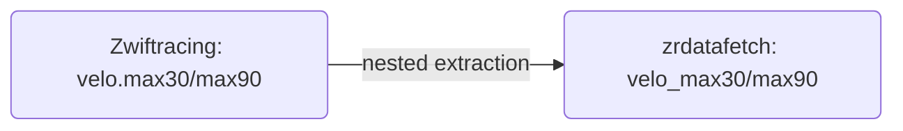

# Design: GH#17 (extension) — Add vELO2 max30/max90 to ZRRider

Spec: `docs/planning/20261003-gh17-spec.md`
Prior work: `docs/planning/20260930-gh17-design.md` (vELO2 `skill` /
`category`, implemented and ticked)
Branch: `pipeline/gh-17`
Issue: https://github.com/puckdoug/zpdatafetch/issues/17

The prior spec is complete. This design covers only the new `velo.max30` /
`velo.max90` / `velo.max30Category` / `velo.max90Category` fields.

## Checklist

- [x] 1. Extend `test/fixtures/zr_rider_550564.json`: add the issue comment's
  exact `max30`, `max90`, `max30Category`, `max90Category` keys to the
  existing `velo` object; leave every existing `velo` value untouched.
- [x] 2. Write failing tests in `test/test_zrdatafetch/test_zrrider.py` for
  the six new fields, defaults, malformed input, `asdict()`, and `repr`.
  Confirm red.
- [x] 3. Implement the six flat fields, docstring entries, and `from_dict()`
  extraction in `src/zrdatafetch/zrrider.py`; tests green.
- [x] 4. Run the full suite `just test`; no existing assertion changes.
- [x] 5. Update `CHANGELOG.md`, `README.md`, and `docs/DATA_DICTIONARY.md`.
- [x] 6. Final validation: `just test` and `just check` pass; `velo` still in
  `known_fields`; no `velo` sub-object leaks into `extras()` / `excluded()`.
  DONE.

## Design decisions

1. **Flat `velo_*` naming.** Follows the existing convention. New fields,
   in order: `velo_max30`, `velo_max90`, `velo_max30_category_number`,
   `velo_max30_category_name`, `velo_max90_category_number`,
   `velo_max90_category_name`. No nested sub-dataclass (spec non-goal).

   | Field                        | Type    | Default | Source                        |
   | ---------------------------- | ------- | ------- | ----------------------------- |
   | `velo_max30`                 | `float` | `0.0`   | `velo.max30`                  |
   | `velo_max90`                 | `float` | `0.0`   | `velo.max90`                  |
   | `velo_max30_category_number` | `int`   | `0`     | `velo.max30Category.number`   |
   | `velo_max30_category_name`   | `str`   | `''`    | `velo.max30Category.name`     |
   | `velo_max90_category_number` | `int`   | `0`     | `velo.max90Category.number`   |
   | `velo_max90_category_name`   | `str`   | `''`    | `velo.max90Category.name`     |

2. **`velo` stays in `known_fields`.** It is a single top-level key already
   listed; sub-fields are extracted from it, so no change to the
   classification loop and nothing leaks into `_extra` / `_excluded`.

3. **Fixture, not a new file.** Add the four new keys to the existing
   `zr_rider_550564.json` `velo` object using the issue comment's exact
   values. Keep the fixture's existing `race` / `factors` / `skill` /
   `category` values so no existing assertion changes. This puts the exact
   production values that triggered the request into the regression test.

4. **Malformed values fall back to defaults.** Reuse `safe_float` /
   `safe_int` / `safe_str` (`src/zrdatafetch/zr_utils.py`); `None` or
   non-numeric input yields `0.0` / `0` / `''` and never raises (spec
   required behavior 3).

5. **No other change.** `asdict()`, `extras()`, `excluded()`, the fetch
   layer, CLI, and `--raw` are untouched.

6. **`zrriderfetch.py` rebuild path out of scope.** The `zwift_id == 0`
   manual rebuild drops newer fields; the new fields inherit that latent
   bug. Logged as a separate follow-up in the prior spec. Do not fix here.

## Step details

### Step 1 — fixture (modify `test/fixtures/zr_rider_550564.json`)

In the top-level `"velo"` object, after `"category"`, add the four keys with
the issue comment's exact values; keep the existing `race`, `timeTrial`,
`factors`, `skill`, `category` values as they are:

```json
  "velo": {
    "race": 432.73065125557014,
    "timeTrial": 441.60965517467037,
    "factors": {
      "endurance": 403.4543215640642,
      "pursuit": 400.02650976543055,
      "sprint": 549.3658233937314,
      "punch": 483.3924028713085,
      "climb": 386.25065653902146,
      "timeTrial": 479
    },
    "skill": {
      "endurance": 0,
      "pursuit": 0,
      "sprint": 0.3206484167583312,
      "punch": 0,
      "climb": 0,
      "timeTrial": 0
    },
    "category": { "number": 8, "name": "Silver" },
    "max30": 434.86035000000004,
    "max90": 453.5100245027948,
    "max30Category": { "number": 8, "name": "Silver" },
    "max90Category": { "number": 8, "name": "Silver" }
  }
```

No other fixture key changes.

### Step 2 — failing tests (modify `test/test_zrdatafetch/test_zrrider.py`)

Add two classes after `TestZRRiderVeloCategory` (currently ends line 202).
Use exact equality for the fixture floats, matching the existing
`velo_skill_sprint` test style:

```python
class TestZRRiderVeloMax30:
  """Test vELO2 max30 fields (gh#17)."""

  def test_velo_max30(self, rider: ZRRider) -> None:
    assert rider.velo_max30 == 434.86035000000004

  def test_velo_max30_category_number(self, rider: ZRRider) -> None:
    assert rider.velo_max30_category_number == 8

  def test_velo_max30_category_name(self, rider: ZRRider) -> None:
    assert rider.velo_max30_category_name == 'Silver'


class TestZRRiderVeloMax90:
  """Test vELO2 max90 fields (gh#17)."""

  def test_velo_max90(self, rider: ZRRider) -> None:
    assert rider.velo_max90 == 453.5100245027948

  def test_velo_max90_category_number(self, rider: ZRRider) -> None:
    assert rider.velo_max90_category_number == 8

  def test_velo_max90_category_name(self, rider: ZRRider) -> None:
    assert rider.velo_max90_category_name == 'Silver'
```

Extend `TestZRRiderMissingFields` (after `test_malformed_velo_skill_category`):

```python
  def test_missing_velo_max_fields(self) -> None:
    data = {
      'riderId': 1,
      'name': 'Test',
      'race': {'current': {'rating': 100, 'mixed': {'category': 'Bronze'}}},
    }
    rider = ZRRider.from_dict(data)
    assert rider.velo_max30 == 0.0
    assert rider.velo_max90 == 0.0
    assert rider.velo_max30_category_number == 0
    assert rider.velo_max30_category_name == ''
    assert rider.velo_max90_category_number == 0
    assert rider.velo_max90_category_name == ''

  def test_velo_without_max_fields(self) -> None:
    data = {
      'riderId': 1,
      'name': 'Test',
      'race': {'current': {'rating': 100, 'mixed': {'category': 'Bronze'}}},
      'velo': {'race': 100.0, 'factors': {'sprint': 200.0}},
    }
    rider = ZRRider.from_dict(data)
    assert rider.velo_race == pytest.approx(100.0)
    assert rider.velo_max30 == 0.0
    assert rider.velo_max30_category_number == 0
    assert rider.velo_max30_category_name == ''

  def test_malformed_velo_max_fields(self) -> None:
    data = {
      'riderId': 1,
      'name': 'Test',
      'race': {'current': {'rating': 100, 'mixed': {'category': 'Bronze'}}},
      'velo': {
        'max30': 'not-a-number',
        'max90': None,
        'max30Category': {'number': 'not-a-number', 'name': None},
        'max90Category': {'number': None, 'name': None},
      },
    }
    rider = ZRRider.from_dict(data)
    assert rider.velo_max30 == 0.0
    assert rider.velo_max90 == 0.0
    assert rider.velo_max30_category_number == 0
    assert rider.velo_max30_category_name == ''
    assert rider.velo_max90_category_number == 0
    assert rider.velo_max90_category_name == ''
```

Add to `TestZRRiderAsDict` (after `test_repr_has_new_velo_fields`):

```python
  def test_asdict_has_velo_max_fields(self, rider: ZRRider) -> None:
    d = rider.asdict()
    for key in (
      'velo_max30',
      'velo_max90',
      'velo_max30_category_number',
      'velo_max30_category_name',
      'velo_max90_category_number',
      'velo_max90_category_name',
    ):
      assert key in d
    assert d['velo_max30'] == 434.86035000000004
    assert d['velo_max90'] == 453.5100245027948
    assert d['velo_max30_category_number'] == 8
    assert d['velo_max30_category_name'] == 'Silver'

  def test_repr_has_velo_max_fields(self, rider: ZRRider) -> None:
    text = repr(rider)
    assert 'velo_max30' in text
    assert 'velo_max30_category_name' in text
```

Add a leak guard to `TestZRRiderExtraFields` (keeps requirement 4 honest):

```python
  def test_velo_not_in_extras_or_excluded(self, rider: ZRRider) -> None:
    assert 'velo' not in rider.extras()
    assert 'velo' not in rider.excluded()
```

Run `python -m pytest test/test_zrdatafetch/test_zrrider.py -q`. New tests
fail (`AttributeError` for missing fields, or assertion failure); existing
tests still pass.

### Step 3 — implementation (modify `src/zrdatafetch/zrrider.py`)

Docstring: after `velo_category_name` (line 79), add:

```python
    velo_max30: vELO2 30-day max rating
    velo_max90: vELO2 90-day max rating
    velo_max30_category_number: vELO2 30-day max category number
    velo_max30_category_name: vELO2 30-day max category name
    velo_max90_category_number: vELO2 90-day max category number
    velo_max90_category_name: vELO2 90-day max category name
```

Fields: after the `Velo category` block (line 147), add:

```python
  # Velo max (vELO2 max30/max90)
  velo_max30: float = 0.0
  velo_max90: float = 0.0

  # Velo max category (vELO2 max30Category/max90Category)
  velo_max30_category_number: int = 0
  velo_max30_category_name: str = ''
  velo_max90_category_number: int = 0
  velo_max90_category_name: str = ''
```

Extraction: after the `Velo category` extraction (line 349), add:

```python
      # Velo max (vELO2 max30/max90)
      velo_max30 = safe_float(extract_nested_value(data, 'velo', 'max30'))
      velo_max90 = safe_float(extract_nested_value(data, 'velo', 'max90'))
      velo_max30_category_number = safe_int(
        extract_nested_value(data, 'velo', 'max30Category', 'number'),
      )
      velo_max30_category_name = safe_str(
        extract_nested_value(data, 'velo', 'max30Category', 'name'),
      )
      velo_max90_category_number = safe_int(
        extract_nested_value(data, 'velo', 'max90Category', 'number'),
      )
      velo_max90_category_name = safe_str(
        extract_nested_value(data, 'velo', 'max90Category', 'name'),
      )
```

Return: add six keyword arguments to `return cls(...)` after
`velo_category_name=velo_category_name,` (line 410):

```python
        velo_max30=velo_max30,
        velo_max90=velo_max90,
        velo_max30_category_number=velo_max30_category_number,
        velo_max30_category_name=velo_max30_category_name,
        velo_max90_category_number=velo_max90_category_number,
        velo_max90_category_name=velo_max90_category_name,
```

No change to `known_fields`, `recognized_but_excluded`, `asdict()`,
`extras()`, or `excluded()`.

Run `python -m pytest test/test_zrdatafetch/test_zrrider.py -q` → green.

### Step 4 — full suite (no file changes)

`just test`. All previously passing tests still pass; the only additions are
the new tests (spec acceptance "no existing `test_zrrider.py` assertion
changes").

### Step 5 — docs (modify `CHANGELOG.md`, `README.md`,
`docs/DATA_DICTIONARY.md`)

`CHANGELOG.md` — append to the `## [2.4.2]` section (lines 3–10):

```markdown
- `zrdata riders`: `ZRRider` also exposes the vELO2 `velo.max30` /
  `velo.max90` ratings and their categories
  (`velo_max30`, `velo_max90`, `velo_max30_category_number`,
  `velo_max30_category_name`, `velo_max90_category_number`,
  `velo_max90_category_name`) (issue #17).
```

`README.md` — in the `**ZRRider**` bullet list after `velo_category_name`
(line 656):

```markdown
- `velo_max30`: vELO2 30-day max rating
- `velo_max90`: vELO2 90-day max rating
- `velo_max30_category_number`: vELO2 30-day max category number
- `velo_max30_category_name`: vELO2 30-day max category name
- `velo_max90_category_number`: vELO2 90-day max category number
- `velo_max90_category_name`: vELO2 90-day max category name
```

`docs/DATA_DICTIONARY.md` — after the `vELO2 Category` section (ends line
3486), insert two sections following the existing table + note + mermaid
format:

````markdown
#### vELO2 Max 30 / Max 90

| Raw API Field | Python Attribute | Type  | Transformation         | Lineage  |
| ------------- | ---------------- | ----- | ---------------------- | -------- |
| `velo.max30`  | `velo_max30`     | float | Nested path extraction | Mastered |
| `velo.max90`  | `velo_max90`     | float | Nested path extraction | Mastered |

The rider's maximum vELO2 rating over the past 30 / 90 days. Missing or
malformed values fall back to `0.0`.



---

#### vELO2 Max Category

| Raw API Field                | Python Attribute            | Type | Transformation         | Lineage  |
| ---------------------------- | --------------------------- | ---- | ---------------------- | -------- |
| `velo.max30Category.number`  | `velo_max30_category_number`| int  | Nested path extraction | Mastered |
| `velo.max30Category.name`    | `velo_max30_category_name`  | str  | Nested path extraction | Mastered |
| `velo.max90Category.number`  | `velo_max90_category_number`| int  | Nested path extraction | Mastered |
| `velo.max90Category.name`    | `velo_max90_category_name`  | str  | Nested path extraction | Mastered |

The vELO2 category bucket for the 30 / 90-day max rating. Missing or
malformed values fall back to `0` and `''`.


````

### Step 6 — final validation

- `just test` passes; `just check` (ruff + ty) passes.
- `grep -n "'velo'" src/zrdatafetch/zrrider.py` still shows `velo` in
  `known_fields` (line 177); `recognized_but_excluded` untouched.
- No scratch files left in `tmp/`.

## Out of scope (per spec)

- Existing `velo.race`, `velo.factors.*`, `velo.skill.*`, `velo.category.*`.
- `seed`, handicaps, phenotype, race stats, fetch endpoints, CLI flags,
  `--raw`, JSON output beyond the added fields.
- Nested sub-dataclass for `velo`.
- New dependency.
- `zrriderfetch.py` `zwift_id == 0` rebuild dropping newer fields.
